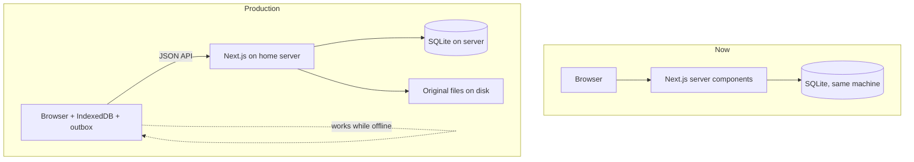
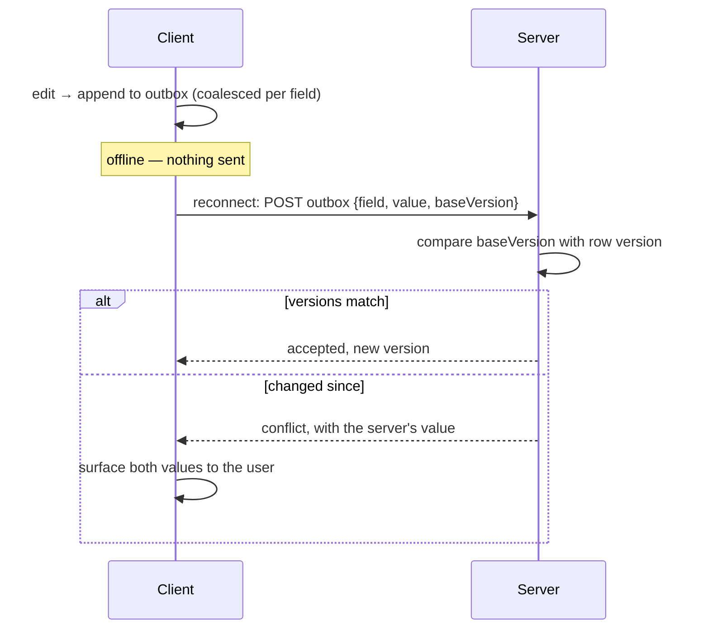

# PNHS Records — Production Design

**Audience:** a developer implementing the production round.
**Companion documents:** [technical-design.md](technical-design.md) describes the system as it
stands today; [changes.md](changes.md) is the prioritised backlog this design serves.

This document covers the four areas that need designing before code: multi-format import,
accounts and roles, offline editing with sync, and deployment.

---

## 1. What changes, in one picture

Today the app is single-machine and local: pages read SQLite directly, one user, no accounts.

Production changes three things at once, and they interact:



The consequential shift is the second one: **an offline client cannot read the server's SQLite
directly**, so an API layer becomes necessary for anything that must work offline. That single
requirement is what makes item #8 large.

Read-only pages that need no offline support can keep reading SQLite in server components. Do
not convert the whole app.

---

## 2. Multi-format import

### Dispatcher

Three parsers behind one entry point, all producing the existing `Sf10Record`
([lib/sf10/types.ts](../lib/sf10/types.ts)):

```
file → sniff → ┬ SF10-SHS   .xlsx, sheets FRONT / BACK      (built)
               ├ SF10-JHS   .xlsx, sheets Front / Back      (map verified)
               └ Form 137   .docx, two internal variants     (to build)
                                    ↓
                              Sf10Record → database
```

**Sniffing rules.** `.docx` → Form 137. `.xlsx` → read sheet names: `FRONT`/`BACK` is SHS,
`Front`/`Back` is JHS. The casing difference is reliable across every real file inspected.
Anything unrecognised must **fail loudly** — a silently mis-parsed permanent record is worse
than a rejected file.

`importBytes()` in [lib/import/import-sf10.ts](../lib/import/import-sf10.ts) becomes the
dispatcher. Its existing hash dedup, upsert and issue recording are format-independent and
stay as they are.

### Form 137: two variants, one normaliser

The 20 sample files split by how grades are stored:

| Variant | Count | Extraction |
|---|---|---|
| **Word tables** | 17 | Parse `<w:tbl>` directly. Rows and cells map cleanly to subject rows. |
| **Embedded worksheets** | 3 | Each `word/embeddings/Microsoft_Excel_Worksheet*.xlsx` is a complete workbook — open with the existing `Workbook.fromBuffer()` and read cells with `getCell()`. |

Both yield 8 units per file: **4 years × (grades, monthly attendance)**. Extraction differs;
everything after it is shared.

Learner identity comes from the Word body text in both variants. Word splits runs mid-word for
formatting reasons, so the parser must **join all runs within a paragraph before matching**,
then match labels tolerantly — real files contain `FEM ALE`, `Year: 19 82`, `F ISHERMAN` and
`Gen. Av e: 80`.

**Rule to encode explicitly: never recompute a Form 137 final rating.** Quarters
`75, 80, 85, 87` carry a final of `83.20`, not their mean of `81.75` — the old curriculum used
a different computation that is not documented anywhere available. Store what the document
says. This is the same principle as the SF10 rule about not writing formula cells, for the
same reason: the source document is the authority.

`PALIZA` has 16 tables rather than 8. Investigate before generalising — likely a transferee or
two-school record. Flag rather than guess.

### Storing originals

Every imported file is kept on disk, keyed by its existing SHA-256, with a `source_files` row
pointing at it. Two reasons: a Form 137 cannot be reprinted onto a modern form, so the original
*is* the reissuable artefact; and for SF10 it makes any future re-parse possible without asking
the registrar for files again.

### `curriculum` and the print guard — do not skip this

Form 137 terms are stored with a `curriculum = 'old'` marker on `enrollment_terms`. That column
is not cosmetic; **one existing function will misbehave without a guard against it.**

`availableForms()` in [../lib/db/queries.ts](../lib/db/queries.ts) decides which print buttons
appear purely from grade level:

```ts
if (terms.some((t) => t.level <= 10)) forms.push("jhs");
```

Store a Form 137 learner's First–Fourth Year as levels 7–10 — which is the natural mapping —
and the record page will offer **"Print SF10 JHS"** for a 1995 record. That is exactly the
outcome the archive-only decision exists to prevent, arrived at by accident.

**`availableForms()` must exclude terms where `curriculum = 'old'`.** A learner with only
Form 137 terms gets no print buttons at all; the original `.docx` is offered for download
instead.

---

## 3. Migrations — build this first

Everything else in this document adds columns to tables that **already hold real learner
data**. There is currently no mechanism that can do that.

`db/schema.sql` is eight `CREATE TABLE IF NOT EXISTS` statements, re-executed on every boot by
`getDb()`. That is idempotent and self-repairing for *new* tables, and it has served well. But:

> **`CREATE TABLE IF NOT EXISTS` cannot alter an existing table.** Adding a column to one of
> those statements is a silent no-op on any database where the table already exists.

The production round introduces roughly a dozen new columns — `deleted_at`, `deleted_by`,
`version`, `curriculum`, `units_earned`, guardian fields, place of birth. On the live database
every one of them would simply fail to appear, and nothing would say so. The failure surfaces
later, as a query reading a column that does not exist.

### The mechanism

`PRAGMA user_version` as the schema version, with ordered steps applied on boot **after** the
existing create pass:

```
1. read PRAGMA user_version          → current
2. for each migration numbered > current, in order:
       run it inside a transaction
       set PRAGMA user_version = its number
3. new columns therefore arrive exactly once, on whichever database is running
```

Rules that matter:

- Migrations are **append-only and never edited** once run anywhere. Fix a bad migration with a
  new one.
- Each runs in its own transaction, so a failure leaves the version unchanged and the database
  consistent.
- `CREATE TABLE IF NOT EXISTS` in `schema.sql` stays as it is for brand-new databases; the
  migration list handles existing ones. A fresh database runs the creates, then the migrations
  find nothing to do.
- **Back up before running migrations against real data.** See §6.

This is roughly 30 lines of code and it is not optional once real records exist.

---

## 4. Accounts and roles

Two roles, as specified:

| | Admin | Adviser |
|---|---|---|
| Search, view, print | ✓ | ✓ |
| Import, add, edit | ✓ | ✓ |
| Delete | ✓ | ✓ |
| Restore a deleted record | ✓ | — |
| Manage adviser accounts | ✓ | — |

### Implementation

- `users` — id, username, `password_hash`, `role`, `active`, timestamps.
- `sessions` — token, user, expiry. Signed, HTTP-only, `SameSite=Lax` cookie.
- Hashing with **`scrypt` from `node:crypto`**. No new dependency; consistent with the rest of
  the project's dependency discipline.
- Route protection in middleware, applied to pages *and* API endpoints. Endpoints must be
  checked independently — an offline client calls them directly.

The unglamorous parts, which are the ones that get skipped:

- **Rate limiting and lockout on login.** Without it, a LAN-local brute force against
  `pantao123` succeeds in minutes.
- **A minimum password policy**, because advisers will otherwise choose the school name.
- **Invalidate existing sessions on password change or account deactivation.** A deactivated
  adviser with a live cookie is still an adviser until it expires.
- Session cookies: `HttpOnly`, `Secure`, `SameSite=Lax`, with a real expiry.

### Delete becomes soft delete

`students` gains `deleted_at` and `deleted_by`. Deleting sets them; every query filters them
out. The adviser experience is unchanged — the record disappears from search, and the
typed-LRN confirmation still applies — but an admin can restore it, and the action is
attributable.

It also keeps a learner's id stable across a delete-and-reimport, where today they would come
back with a new id.

> ### ⚠ Soft delete breaks the importer unless you change this query too
>
> The dedup rule in [../lib/import/import-sf10.ts](../lib/import/import-sf10.ts) treats a file
> as already-imported only if it produced a learner **who still exists**:
>
> ```sql
> FROM import_files f
> JOIN students s ON s.id = f.student_id
> WHERE f.sha256 = ? AND f.status IN ('imported','updated')
> ```
>
> Soft delete leaves the student row in place. The join therefore still matches, the file is
> still reported "already imported", and **a soft-deleted record cannot be restored by
> re-importing its file.**
>
> That is the exact bug that was reported and fixed earlier in this project — hard delete left
> the `import_files` row behind and branded the file permanently imported. Soft delete
> reintroduces it by a different route.
>
> **The query must become:**
>
> ```sql
> JOIN students s ON s.id = f.student_id AND s.deleted_at IS NULL
> ```
>
> This is called out here, next to the soft-delete decision, because whoever implements soft
> delete will be editing `queries.ts` and has no reason to go looking inside the importer.

### Audit

`record_history` is append-only: student, table, field, old value, new value, user, timestamp.
It serves autosave recovery (#4) and account attribution (#6) with one mechanism. Write to it
inside the same transaction as the change itself, or the two can disagree.

**Growth needs a decision, not silence.** Autosave-as-you-type means a row per field change per
learner, forever. At 5,000 learners with ~40 subjects and four quarters each, ordinary encoding
generates hundreds of thousands of rows a year, and re-encoding a corrected grade adds more.

That is not a performance problem — SQLite will not notice — but it is unbounded growth in a
table nobody prunes. Either set a retention window (full detail for the current school year,
then keep only the last value per field) or state explicitly that unbounded growth is accepted
because the rows are small. Decide it now, while the table is empty.

---

## 5. Offline editing and sync

The largest item. Design it deliberately, because a records system that silently loses or
mis-merges a grade is worse than one that refuses to work offline.

### What this costs, and why

**Estimated 4–6 weeks.** Everything else in the backlog totals around 13 days. This one item is
therefore roughly three-quarters of the production round, and the estimate covers an API layer,
IndexedDB, an outbox, per-row versioning, conflict UI, a service worker, PWA install, offline
record creation and LAN HTTPS — each with its own failure modes.

> **Open question that should be settled before any of it is built.**
>
> The server sits on the school LAN. Everyone in the building reaches it whether or not the
> internet is up, so "no internet" is not by itself a reason for any of this work.
>
> The two scenarios that *would* justify it are very different in cost:
>
> | Scenario | What it actually needs | Cost |
> |---|---|---|
> | Advisers encode grades on a laptop away from school, then sync | Everything in this section | 4–6 weeks |
> | Insurance against the server or network being down | A UPS, plus a read-only cached copy so records stay *viewable* | ~2–3 days |
>
> If the real need is the second, most of this section should be deleted rather than built.
> Confirm which before starting.

### Scope boundary

Not everything needs to work offline. The useful minimum:

| Works offline | Requires the server |
|---|---|
| Search the learner index | Importing files |
| View any record opened before going offline | Printing an SF10 |
| Edit grades and learner details | Managing accounts |
| Create a new record | Restoring a deleted record |

Printing needs the template and the fill engine, both server-side. Import needs files that live
on the server. Neither is worth replicating client-side.

### Client storage

**IndexedDB**, holding:

1. The learner index — already shipped whole to the browser for search, so this is a natural
   fit. At 5,000 learners the payload is roughly 400 KB; slim the fields and cache it rather
   than re-sending it each load.
2. Full records for anything opened, so they remain viewable and editable offline.
3. The **outbox**: queued changes not yet accepted by the server.

### Sync protocol



- **Version at the unit of edit, not the parent row.** `term_subjects` is already one row per
  subject, so that row carries the version. This is the detail that decides whether the feature
  is usable — see below.
- Changes are **coalesced per field** — autosave-as-you-type would otherwise generate an
  operation per keystroke. One pending change per field is enough.
- **Conflicts are shown, never merged silently.** If two people edited the same grade, a person
  decides. Last-writer-wins is acceptable for a section name; it is not acceptable for a mark
  on a permanent record.
- `record_history` records both sides of a conflict, so nothing is lost even if the wrong
  choice is made.

> ### ⚠ Versioning granularity decides whether conflicts are real
>
> Versioning the *term* while sending changes *per field* manufactures conflicts that never
> happened. Two advisers editing different subjects in the same Grade 9 term both bump the same
> term version, so the second one is told their edit conflicts — when nothing overlapped.
>
> On a grid where someone encodes forty subjects in a sitting, that fires constantly. Users
> learn within a day to dismiss the conflict prompt without reading it, and the one safety
> mechanism protecting grade data becomes noise.
>
> Version `term_subjects` rows individually. A genuine conflict — two people editing the same
> subject's Q2 — is then rare and worth a person's attention, which is the entire point.

### Practical requirements

- **HTTPS is mandatory** — service workers do not run over plain HTTP except on `localhost`.
  This is needed for the LAN deployment regardless; see §6. Note that a self-signed certificate
  must be installed in the **trust store of every client device**, or registration fails and
  offline silently does not work.
- New records created offline need client-generated ids that cannot collide. Use a UUID as a
  client key, mapped to the server's integer id on first sync.
- **Two people creating the same learner offline will violate `UNIQUE(lrn)` on sync.** This is
  the most likely offline conflict in practice — two advisers both encoding a new transferee.
  A blind insert fails and the second adviser's work appears lost. On sync, match an incoming
  new record against existing learners **by LRN first**, and merge into that learner rather
  than inserting.
- The outbox must survive a browser restart, and the user must be able to see that changes are
  pending. Silent queues erode trust the first time something appears lost.

---

## 6. Deployment

### Hardware

72 real files average **180 KB** — that figure is measured and reliable.

The database figure is weaker and should be read as a conservative ceiling, not a measurement.
The current database is 167 KB for 22 learners, which divides to 7.6 KB each — but 18 of its 41
pages are the minimum one-page-per-table-and-index overhead, so **44% of it is fixed cost that
does not grow with learners**. Extrapolating linearly from 22 rows overstates the real marginal
cost, probably by several times. It errs high, which is safe for capacity planning; just don't
quote it as a per-learner measurement.

| Resource | At 5,000 learners | Reasoning |
|---|---|---|
| Original files | ~900 MB | 5,000 × 180 KB |
| Database | 40–80 MB | Conservative ceiling; see the note above — the real figure is likely well under this |
| **Total working set** | **~2 GB** | Storage is not the constraint |
| RAM | 8 GB comfortable, 4 GB workable | Next.js plus SQLite page cache, ~10 concurrent users |
| CPU | Any modern dual/quad core | Load is I/O and template filling, not computation |
| Disk | **SSD, strongly recommended** | SQLite is sensitive to write latency |

Any small-form-factor office PC or mini-PC from the last decade is sufficient. A refurbished
i5 with 8 GB and an SSD is comfortably more than enough — this workload is small. Spend the
budget on the SSD and a backup disk, not the processor.

### Operational requirements

These matter more than the hardware:

1. **The database must not live on a synced folder.** OneDrive, Google Drive and Dropbox
   corrupt SQLite by copying it mid-write. This is currently true of the development setup and
   is the most urgent item to fix at deployment.
2. **Backups, with two properties people usually skip.** A nightly `VACUUM INTO` snapshot to a
   second disk, retained for some weeks — the database is small enough that this is trivial.
   But:
   - **A second disk in the same box is not a backup.** One fire, theft or surge takes both.
     One copy must leave the building — an encrypted external drive the registrar takes home is
     enough at this scale.
   - **An untested backup is a hypothesis.** Restore one into a scratch copy of the app on a
     schedule and confirm a learner's record opens. A backup nobody has restored has an
     uncomfortable habit of not restoring.
   - Take one **before running migrations** (§3) against real data.
3. **HTTPS on the LAN.** Required for service workers, and appropriate for learner records
   regardless. A self-signed certificate installed on the school's machines is adequate.
4. **Do not port-forward this to the internet.** If off-site access is ever wanted, use a VPN
   or Tailscale. Exposing learner records directly is not an acceptable trade for convenience.
5. **A UPS**, or at minimum accept that a power cut mid-write is what WAL mode and backups are
   protecting against.

### Personal data

Worth stating plainly, because neither this system nor its documentation has acknowledged it so
far: this holds the personal data of **thousands of children**. Names, birthdates, sex, and —
once Form 137 import lands — parents' names, occupations and home addresses.

That is a materially different obligation from a folder of spreadsheets on one PC, because a
server makes it reachable and a database makes it bulk-exportable.

Not legal advice, but the things a school would be expected to have thought about:

- **The Philippines' Data Privacy Act (RA 10173) applies to schools.** Someone should be named
  as accountable for this data, and the school's existing privacy practice should cover it.
  Flagging it as a live consideration is not the same as having addressed it.
- **Encryption at rest.** Full-disk encryption on the server is the cheap version and stops the
  obvious failure — the machine or a backup drive walking out of the building. It does nothing
  against a running-server compromise, so it is a floor, not a solution.
- **Encrypt the offsite backup copy.** It is the copy most likely to be lost.
- **Retention.** Permanent records are, by design, permanent — but `record_history`, sessions
  and import logs are not, and should not accumulate indefinitely.
- **Access is a privacy control, not just a convenience.** The adviser role can read every
  learner in the school; whether that is appropriate is a policy question for the school, not a
  technical one, and it should be asked rather than assumed.

### Scale check at 5,000 learners

Worth stating because the numbers are reassuring:

- ~200,000 `term_subjects` rows. SQLite handles this without effort; the existing indexes on
  `student_id` and `term_id` are sufficient.
- Client-side search over a 5,000-row index stays responsive, and is required for offline
  search anyway.
- The one thing that *would* need revisiting is bulk-importing thousands of files in a single
  request. Import should move to a background job with progress rather than one long HTTP call.

---

## 7. Suggested build order

0. **Migrations (§3) — before anything that adds a column.** Nothing else in this list can
   reach the live database without it.
1. Items #1–#3 from [changes.md](changes.md) — small, independent, immediately useful.
2. **#4 autosave with `record_history`** — the history table is a prerequisite for auditing.
3. **#5 JHS importer** — largely de-risked; completes SF10 coverage.
4. **#6 accounts** — before offline, which needs identity to attribute changes.
5. **#7 Form 137** — self-contained; can run in parallel with accounts if there are two people.
6. **#8 offline and sync** — last, because it depends on the API surface stabilising and on
   accounts existing. Settle the open question in §5 before starting it.
7. **#9 deploy.**

Do not start #8 before #6. Sync without identity cannot attribute or resolve a conflict.

---

## 8. Testing

The system currently has good coverage of the part that matters most — `npm run roundtrip` and
`npm run verify` prove the SF10 fill path end to end — and **no committed browser tests at
all**. The Playwright flows used during development were never added to the repo.

This round adds accounts, two more parsers and a sync protocol to a system holding permanent
academic records. That surface cannot go in untested.

The minimum worth committing alongside the work:

| Area | Test |
|---|---|
| JHS importer | Extend `npm run roundtrip` to cover JHS files — same guarantee already proven for SHS |
| Form 137 | Parse all 20 sample files in CI; assert learner identity and subject counts. Both variants, plus `PALIZA` |
| Migrations | Run them against a copy of a **pre-migration** database and assert the columns exist and data survives |
| Accounts | An adviser cannot reach admin routes; a deactivated account cannot act |
| Sync | Two clients editing the same subject conflict; two clients editing different subjects **do not** |
| Browser flows | Commit the existing Playwright flows — search, edit, delete, import, print |

The sync row is the one that would have caught the versioning-granularity bug described in §5
before it reached a user.
