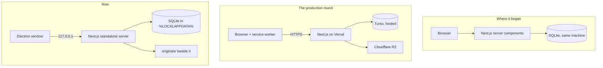

# TALA — Production Design

**Audience:** a developer implementing or maintaining this system.
**Companion documents:** [technical-design.md](technical-design.md) describes the system as it
stands today; [changes.md](changes.md) is the backlog this design served.

This document covered the four areas that needed designing before code: multi-format import,
accounts and roles, offline editing with sync, and deployment.

> ### Status — 18 August 2026: the system is a local Windows application
>
> It ran hosted, with accounts. It is now an Electron app installed on the registrar's PC and
> opened with **one password**. Two of the four areas this document was written to design no
> longer exist, and a third answered its own open question by disappearing.
>
> Sections are corrected in place rather than deleted, because the reasoning in them is what
> stops the next person re-deriving it — and in the case of §4 and §5, re-building it.
>
> | Area | State |
> |---|---|
> | §2 Multi-format import — SHS, JHS, Form 137 | **Built**, and untouched by the move |
> | §3 Migrations | **Built**, with a different mechanism — see the correction in §3 |
> | §4 Accounts and roles | **Built, then removed.** Replaced by one password — see §4 |
> | §5 Offline editing and sync | **Dissolved.** The open question is answered by architecture — see §5 |
> | §6 Deployment | **Replaced.** Vercel/Turso/R2 → an installer — see §6 |
> | §9 The frontend | **Built**, restyled to "Soft Office", offline chrome removed — see §9 |
>
> Nothing in this document is now blocked on a decision from the school.

---

## 1. What changed, in one picture

The app began single-machine and local: pages read SQLite directly, one user, no accounts. The
production round made it hosted and multi-user. It is now single-machine and local again — but
not back where it started, because everything built in between survived the return.



The shift that made offline sync large was that **an offline client cannot read the server's
SQLite directly**, so an API layer became necessary for anything that had to work disconnected.
When the server is the local machine, that requirement is not satisfied — it is void. Pages read
SQLite in server components again, which is the arrangement the whole of §5 existed to work
around.

What came back from the hosted round and stayed: migrations, the audit trail, the Form 137
importer, the review queue, the redesigned frontend, and a real backup story. What did not:
accounts, object storage, the service worker, and four credentials.

---

## 2. Multi-format import

### Dispatcher

Three parsers behind one entry point, all producing the existing `Sf10Record`
([lib/sf10/types.ts](../lib/sf10/types.ts)):

```
file → sniff → ┬ SF10-SHS   .xlsx, sheets FRONT / BACK      (built)
               ├ SF10-JHS   .xlsx, sheets Front / Back      (built)
               └ Form 137   .docx, two internal variants     (built)
                                    ↓
                              Sf10Record → database
```

**Sniffing rules.** `.docx` → Form 137. `.xlsx` → read sheet names: `FRONT`/`BACK` is SHS,
`Front`/`Back` is JHS. The casing difference is reliable across every real file inspected.
Anything unrecognised must **fail loudly** — a silently mis-parsed permanent record is worse
than a rejected file.

`importBytes()` in [lib/import/import-sf10.ts](../lib/import/import-sf10.ts) becomes the
dispatcher. Its existing hash dedup, upsert and issue recording are format-independent and
stay as they are.

### Form 137: two variants, one normaliser

The 20 sample files split by how grades are stored:

| Variant | Count | Extraction |
|---|---|---|
| **Word tables** | 17 | Parse `<w:tbl>` directly. Rows and cells map cleanly to subject rows. |
| **Embedded worksheets** | 3 | Each `word/embeddings/Microsoft_Excel_Worksheet*.xlsx` is a complete workbook — open with the existing `Workbook.fromBuffer()` and read cells with `getCell()`. |

Both yield 8 units per file: **4 years × (grades, monthly attendance)**. Extraction differs;
everything after it is shared.

Learner identity comes from the Word body text in both variants. Word splits runs mid-word for
formatting reasons, so the parser must **join all runs within a paragraph before matching**,
then match labels tolerantly — real files contain `FEM ALE`, `Year: 19 82`, `F ISHERMAN` and
`Gen. Av e: 80`.

**Rule to encode explicitly: never recompute a Form 137 final rating.** Quarters
`75, 80, 85, 87` carry a final of `83.20`, not their mean of `81.75` — the old curriculum used
a different computation that is not documented anywhere available. Store what the document
says. This is the same principle as the SF10 rule about not writing formula cells, for the
same reason: the source document is the authority.

`PALIZA` has 16 tables rather than 8. **Settled by the build: it is one learner's form
duplicated inside a single file, not two learners and not a transferee.** The first copy is
imported and the rest flagged. `npm run test:f137` parses all 20 sample files, including this
one and both storage variants.

Two other things the build settled that this design could not:

- **No LRN exists on these forms.** A generated `F137-…` key derived from name and birthdate
  keeps identity stable across re-imports, and `lrn_placeholder` makes the UI show *No LRN ·
  pre-2011 record* so an invented value is never presented as a real one.
- **A year with printed subject names but no marks is not an attended year.** One learner
  dropped out in January; importing the blank Third and Fourth Year would have asserted an
  enrolment that never happened.

### Storing originals

Every imported file is kept on disk, keyed by its existing SHA-256, with a `source_files` row
pointing at it. Two reasons: a Form 137 cannot be reprinted onto a modern form, so the original
*is* the reissuable artefact; and for SF10 it makes any future re-parse possible without asking
the registrar for files again.

### `curriculum` and the print guard — do not skip this

Form 137 terms are stored with a `curriculum = 'old'` marker on `enrollment_terms`. That column
is not cosmetic; **one existing function will misbehave without a guard against it.**

`availableForms()` in [../lib/db/queries.ts](../lib/db/queries.ts) decides which print buttons
appear purely from grade level:

```ts
if (terms.some((t) => t.level <= 10)) forms.push("jhs");
```

Store a Form 137 learner's First–Fourth Year as levels 7–10 — which is the natural mapping —
and the record page will offer **"Print SF10 JHS"** for a 1995 record. That is exactly the
outcome the archive-only decision exists to prevent, arrived at by accident.

**`availableForms()` must exclude terms where `curriculum = 'old'`.** A learner with only
Form 137 terms gets no print buttons at all; the original `.docx` is offered for download
instead.

---

## 3. Migrations — build this first · **BUILT, with one correction**

Everything else in this document adds columns to tables that **already hold real learner
data**. There is currently no mechanism that can do that.

`db/schema.sql` is eight `CREATE TABLE IF NOT EXISTS` statements, re-executed on every boot by
`getDb()`. That is idempotent and self-repairing for *new* tables, and it has served well. But:

> **`CREATE TABLE IF NOT EXISTS` cannot alter an existing table.** Adding a column to one of
> those statements is a silent no-op on any database where the table already exists.

The production round introduces roughly a dozen new columns — `deleted_at`, `deleted_by`,
`version`, `curriculum`, `units_earned`, guardian fields, place of birth. On the live database
every one of them would simply fail to appear, and nothing would say so. The failure surfaces
later, as a query reading a column that does not exist.

### The mechanism

> #### ⚠ Correction — the version does **not** live in `PRAGMA user_version`
>
> This section originally specified `PRAGMA user_version` as the schema version. That is the
> conventional answer for SQLite and it does not work here.
>
> **A hosted libSQL database refuses to execute `PRAGMA user_version = n` at all** — it answers
> *"SQL not allowed statement"*. Reading the pragma works; writing it does not. So the read
> would have succeeded, every migration would have applied, the write recording that fact would
> have failed, and the next boot would have applied all of them again — against real learner
> data, with `ALTER TABLE` statements that are not idempotent.
>
> The version lives in a **`schema_version` table** instead, written inside the same transaction
> as the migration it records. See `lib/db/migrations.ts` and commit `f4a988f`.
>
> An existing local database whose version was already recorded in the pragma is adopted on
> first run, so nothing re-applies.

Ordered steps applied on boot **after** the existing create pass:

```
1. read schema_version           → current   (adopting PRAGMA user_version if no row yet)
2. for each migration numbered > current, in order:
       run it inside a transaction
       write its number to schema_version, in that same transaction
3. new columns therefore arrive exactly once, on whichever database is running
```

Rules that matter:

- Migrations are **append-only and never edited** once run anywhere. Fix a bad migration with a
  new one.
- Each runs in its own transaction, so a failure leaves the version unchanged and the database
  consistent.
- `CREATE TABLE IF NOT EXISTS` in `schema.sql` stays as it is for brand-new databases; the
  migration list handles existing ones. A fresh database runs the creates, then the migrations
  find nothing to do.
- **Back up before running migrations against real data.** See §6.

This is roughly 30 lines of code and it is not optional once real records exist.

`npm run test:migrations` runs the steps against a copy of a pre-migration database and asserts
both that the new columns arrive and that the existing rows survive.

---

## 4. Accounts and roles — **BUILT, THEN REMOVED**

> The two-role account system described below was built, ran with real learner data, and was
> removed on 18 August 2026 when the app became a local Windows application. It is recorded
> here rather than deleted, because a future request for roles is a request to build this again
> and the reasoning is worth not re-deriving.

### What replaced it

**One password.** No usernames, no roles, no account management.

- Chosen on first launch, `scrypt`-hashed into the existing `school_settings` key/value table.
  This replaces `npm run create-admin`, and asking a registrar to run a command-line bootstrap
  was never a good answer.
- Changed from **Settings**, which asks for the current one first.
- **Nobody can reset it.** There is no administrator to ask and no recovery address. If it is
  forgotten the way back is a backup, which is one more reason the backup has to be real.
- Five wrong attempts lock guessing out for fifteen minutes.
- The app locks itself after thirty minutes of no use, and whenever it is closed.

Two things carried over from the accounts work unchanged, because neither was about accounts:

- **`lib/auth/password.ts`** — the scrypt parameters, the constant-time verify that fails closed
  on a malformed stored value, and the banned-word list that stops the password becoming the
  school's name. All still right for one password.
- **The guard in every route.** `requireUser()` became `requireUnlocked()` and kept all 28 call
  sites. See the note below on why a local app still needs it.

### Where sessions went

The `sessions` and `login_attempts` tables are dropped by migration 4. Both were shaped by
serverless hosting and neither survives contact with a single local process:

| Then | Now | Why |
|---|---|---|
| `sessions` table, SHA-256 of a cookie token | A `Map` in the server process | The process lifetime *is* the app lifetime, so closing the app ends every session. No expiry sweep, no pruning, no rows to leak |
| `login_attempts` table | An array of timestamps | The table existed because a host may run several instances and an in-process counter would see a fraction of the attempts. One process sees all of them |

> #### `users` is deliberately **not** dropped
>
> Nothing reads it. But `record_history.user_id` names real people on every row written while
> accounts existed, and dropping the table would leave that history pointing at bare integers —
> the audit trail would survive and stop meaning anything.
>
> The column has no foreign key, so keeping the table costs one dormant table on databases that
> already had it, and buys the ability to still answer who changed a grade in August 2026.

### The system that was removed

Two roles, as originally specified:

| | Admin | Adviser |
|---|---|---|
| Search, view, print | ✓ | ✓ |
| Import, add, edit | ✓ | ✓ |
| Delete | ✓ | ✓ |
| Restore a deleted record | ✓ | — |
| Manage adviser accounts | ✓ | — |

Implemented with a `users` table, a `sessions` table, `scrypt` from `node:crypto`, and route
protection applied to pages *and* API endpoints independently.

> #### ⚠ Correction from the build — middleware could not be the guard
>
> The original design said "route protection in middleware". Middleware runs on the Edge
> runtime, where `node:crypto` does not exist, so it **could not verify a session cookie** —
> only notice that one was present. Importing the cookie name from the auth module dragged the
> database layer into the Edge bundle and failed the build outright, which is the boundary
> announcing itself.
>
> Every page, action and route handler called `requireUser()` for itself. `middleware.ts` is now
> deleted entirely, so the discipline is not merely correct — it is the only thing there is.
>
> Two more the build settled: **API routes answer 401, never a redirect** (a caller following a
> redirect gets HTTP 200 and an HTML form where it asked for a workbook, which reads as
> success), and **rate limiting had to move into the database**, because a module-level counter
> is per-instance memory. That second one has now moved back, for the reason in the table above:
> the constraint that forced it is gone.

> #### Why a local app still guards every route
>
> It is tempting to drop `requireUnlocked()` on the grounds that there is nobody to keep out.
> There is: the app is an HTTP server listening on loopback, and every process running as this
> user can send it a request. The password screen is worth exactly as much as the guard behind
> it.
>
> The complementary half is that the server binds **127.0.0.1** and not `0.0.0.0`. Next binds
> the latter by default. See [technical-design.md](technical-design.md) §3.

### `docs/patch-1.md` asks for the roles back

It is the newest requirement in the repository and it asks for a *sharper* split than ever
existed: Admin does everything, **Adviser can only import**. It was written before this pivot
and is superseded by it.

**One password cannot express two permission sets.** Reinstating roles means reinstating
accounts — the `users` table, sessions, per-request role checks and an account-management
screen. It is not a small addition on top of what is here, and the removal above is what it
would have to undo. If the school does want it, the design to follow is the one recorded in
this section.

### Audit

`record_history` is append-only: student, table, field, old value, new value, user, timestamp.
It serves autosave recovery and attribution with one mechanism. Write to it inside the same
transaction as the change itself, or the two can disagree.

**New rows carry a null user**, and that is the real cost of removing accounts. The history
still answers *what changed, from what, to what, and when* — which is what makes
autosave-with-no-undo recoverable, and it is the part used daily. It no longer answers *who*.
On a single shared office machine there was never much of an answer to give.

**Growth still needs a decision, not silence.** Autosave-as-you-type means a row per field
change per learner, forever. At 5,000 learners with ~40 subjects and four quarters each,
ordinary encoding generates hundreds of thousands of rows a year.

That is not a performance problem — SQLite will not notice — but it is unbounded growth in a
table nobody prunes. Either set a retention window or state explicitly that unbounded growth is
accepted because the rows are small. It is still undecided.

### Delete becomes soft delete — **NOT BUILT. Deliberately.**

> Everything in this section describes a design that was **not implemented**. `students` has no
> `deleted_at` and no `deleted_by`, delete is permanent, and there is no restore. The "Restore a
> deleted record" row in the roles table above therefore describes nothing that ever existed.
>
> It was dropped so the importer's dedup query could stay as it is — see the trap below, which
> is the reason. If soft delete is ever added, this section and that trap are the design to
> follow, and the query change is not optional.

The design, if it is picked up:

`students` gains `deleted_at` and `deleted_by`. Deleting sets them; every query filters them
out. The user experience is unchanged — the record disappears from search, and the typed-LRN
confirmation still applies — but it can be restored.

It also keeps a learner's id stable across a delete-and-reimport, where today they would come
back with a new id.

> ### ⚠ Soft delete breaks the importer unless you change this query too
>
> The dedup rule in [../lib/import/import-sf10.ts](../lib/import/import-sf10.ts) treats a file
> as already-imported only if it produced a learner **who still exists**:
>
> ```sql
> FROM import_files f
> JOIN students s ON s.id = f.student_id
> WHERE f.sha256 = ? AND f.status IN ('imported','updated')
> ```
>
> Soft delete leaves the student row in place. The join therefore still matches, the file is
> still reported "already imported", and **a soft-deleted record cannot be restored by
> re-importing its file.**
>
> That is the exact bug that was reported and fixed earlier in this project — hard delete left
> the `import_files` row behind and branded the file permanently imported. Soft delete
> reintroduces it by a different route.
>
> **The query must become:**
>
> ```sql
> JOIN students s ON s.id = f.student_id AND s.deleted_at IS NULL
> ```
>
> This is called out here, next to the soft-delete decision, because whoever implements soft
> delete will be editing `queries.ts` and has no reason to go looking inside the importer.

---

## 5. Offline editing and sync — **DISSOLVED, not deferred**

> This was the largest item in the backlog: an estimated **4–6 weeks**, roughly three-quarters
> of the production round, covering an API layer, IndexedDB, an outbox, per-row versioning,
> conflict UI, a service worker, PWA install, offline record creation and LAN HTTPS.
>
> **It no longer exists.** Not built, not deferred — the problem it solved does not occur in a
> local application. There is no server to be away from and no network to lose. The service
> worker, the manifest, the connection indicator and the `/api/health` probe are all deleted.

### The open question, and how it was answered

The design blocked on one question, and it was never answered by the school:

| Scenario | What it needed | Cost |
|---|---|---|
| Advisers encode grades on a laptop away from school, then sync | Everything in this section | 4–6 weeks |
| Insurance against the server or network being down | A UPS, plus a read-only cached copy | ~2–3 days |

The cheap column was built. The expensive one was never started, and the decision that would
have chosen between them was overtaken: **the answer turned out to be neither.** The records
moved onto the machine that reads them, so being "offline" is not a state the app can be in.

This is worth stating plainly because it is the single largest piece of work this project did
not do, and the reason is architectural rather than budgetary.

### What was built, and is now removed

The read-only half shipped and worked: a service worker (network-first for pages, cache-first
for the shell and fonts), a permanent `Live`/`Cached` chip in the masthead rather than a toast,
a freshness line carrying a real timestamp, editing visibly disabled while cached, and PWA
install. All of it is deleted.

Three things it settled are worth keeping in writing, because each is a trap that recurs:

- **`navigator.onLine` is not the signal.** It reports whether a network interface exists, which
  on a school LAN is true whether or not anything is listening — exactly the outage it was meant
  to cover.
- **An offline state must be able to release itself.** The first version could only return on an
  `online` event, so one failed request left every grade cell disabled with no event coming,
  because the browser had never thought it was offline.
- **Cached pages must expire.** Sign-out purged them, but a browser closed without signing out
  would leave every record the last person opened readable on a shared office machine
  indefinitely.

The general shape of that last one survives the pivot in a different form: the app locks itself
after thirty minutes idle, for the same reason.

### If more than one machine ever needs the records

This is the one thing that would bring the whole section back, harder than before. Two
installations are two databases, and reconciling them is exactly the sync problem — per-row
versioning, conflict resolution, and `UNIQUE(lrn)` violations when two people create the same
transferee — with no server to arbitrate.

**Do not solve it by putting the database on a shared network drive.** SQLite over SMB is the
corruption scenario this design spends its effort avoiding, and it fails intermittently rather
than immediately.

If a second machine is genuinely needed, the honest options are one shared install accessed by
Remote Desktop, or going back to a hosted deployment — which is what the previous round was.

---

## 6. Deployment — **an installer, not a host**

> **This section has now been rewritten twice.** It first specified a mini-PC on the school LAN,
> then Vercel with a hosted database and object storage. Neither survives. What follows is the
> third shape, and the obligations that came with holding this data have outlived all three.

### What ships

| | |
|---|---|
| Application | `TALA-Setup-<version>.exe`, NSIS, per-user install (no administrator needed) |
| Shell | Electron, spawning the Next standalone server on `127.0.0.1` |
| Database | SQLite at `%LOCALAPPDATA%\PNHS Records\pnhs.db` |
| Original files | `%LOCALAPPDATA%\PNHS Records\originals\` |
| Templates | Read from the installed bundle, unchanged |

Four decisions in there that are not obvious:

1. **`%LOCALAPPDATA%`, not `%APPDATA%` and never OneDrive.** SQLite and file-sync clients
   corrupt each other — the client copies the file mid-write. Roaming AppData is synced by
   domain profile roaming, which is the same hazard wearing a different name.
2. **The uninstaller does not delete that folder.** It holds the school's permanent records.
   "The user chose to uninstall" is not consent to destroy the only copy of the data.
3. **One instance only.** `app.requestSingleInstanceLock()` is the first line of
   `electron/main.cjs`. Two processes writing one SQLite file is the corruption every other
   decision here avoids.
4. **The server binds loopback.** See §4 and [technical-design.md](technical-design.md) §3.
   This is the single security property of the desktop shape, and `npm run check:server` is
   wired into the packaging command so it cannot regress quietly.

### The build refuses to ship learner data

`npm run build:desktop` runs `next build`, then **`npm run check:bundle`**, then
electron-builder. The middle step exists because of a real failure, caught by listing a
directory:

Next traces which files each route reads so it can copy them into the standalone bundle, by
evaluating path expressions statically. `join(process.cwd(), "data")` was exactly resolvable —
so it copied the live database, four backups, and twenty Form 137 originals carrying children's
names, their parents' occupations and their home addresses into the bundle. The installer would
have handed them to whoever installed the app.

The tests passed. The installer worked. Nothing said anything.

`check:bundle` now refuses to package a bundle containing a `.db`, a `.docx`, or an `.xlsx`
outside `templates/`. `lib/paths.ts` stops it happening in the first place. Both are needed.

### Operational requirements

The hosted version of this list was about credentials and copies. The desktop version is about
one disk.

1. **The machine is the single point of failure.** No provider replication stands behind it.
   Backing up is a file copy again — which is what the registrar understood before any of this,
   and what the move to hosting took away — but it is now the *whole* mitigation rather than an
   extra layer.
   - **Settings → Back up now**, or `npm run backup` scheduled with Task Scheduler.
   - It uses SQLite's `VACUUM INTO` rather than copying the file, because copying a live
     database catches it mid-write. `originals/` are content-addressed and copy safely.
   - **A copy must leave the building.** An encrypted external drive the registrar takes home is
     enough at this scale.
   - **An untested backup is a hypothesis.** Restore one and open a learner record:
     `$env:PNHS_DATA_DIR = 'E:\pnhs-backup-...'; npm run dev`.
2. **Updates cannot lose records, and no longer depend on remembering that.** Bump the
   version, `npm run build:desktop`, run the installer over the old one. Records live outside
   the install directory, and `runMigrations` copies the database to
   `backups/pre-upgrade-v<from>-to-v<to>-<stamp>/` before applying a schema change. **If that
   copy fails, nothing is migrated.** The version bump is load-bearing and `appId` /
   `productName` must never change — see the README for why each is silent when got wrong.
3. **A replacement machine is a backup, an install and a file copy**, in that order, with the
   app closed and the old database's `-wal` and `-shm` files deleted before the backup's
   `pnhs.db` goes in. The password travels inside the database. The README has the steps; the
   `-wal` detail is the one that corrupts records when skipped.
4. **The password gates the app, not the file.** Anyone who can read `pnhs.db` off the disk has
   every record. **Turn on BitLocker**, and encrypt the backup drive. This is a real reduction
   from the hosted deployment, where the data sat behind a credential, and it is the accepted
   cost of the chosen approach.
5. **Nobody can reset the password.** Write it down somewhere the records are not.
6. **Decommission what is left of the hosted deployment.** The Turso auth token and the three R2
   credentials are live until somebody revokes them **at the provider** — deleting `.env.local`
   and `turso.txt` from the working tree does nothing about that. Revoke them, and confirm every
   archived original is present locally before deleting the bucket.

### Verifying an installed copy

Most of this system is covered by `npm test`, `npm run roundtrip` and `npm run verify`, and the
two packaging failures that produced no error message are covered by `check:bundle` and
`check:server`. What follows is what none of them can reach: **the packaged application on a
machine that has never run it.** Each of these has been proven in pieces; the whole has not.

1. `npm run build:desktop`, then install the `.exe` on a clean machine.
2. First launch shows **Set a password**, not a password prompt. A weak password is refused.
3. `%LOCALAPPDATA%\PNHS Records\pnhs.db` exists with eleven tables at schema version 4.
   **Nothing was written into the install directory.**
4. Import one SF10-SHS, one SF10-JHS and one Form 137. All three land, the review queue shows
   the expected flags, and `originals\` gains three files.
5. Print an SF10 → a Save dialog appears → the file opens in Excel → the numbers match the
   screen and the layout matches a school original. **This is also the outstanding print-preview
   sign-off** — the mechanical evidence is strong and no person has ever confirmed it.
6. Download a Form 137 original and confirm it is byte-identical to the source `.docx`.
7. Edit a grade, reopen the record, confirm it persisted, and confirm `record_history` gained a
   row with a null `user_id`.
8. Close the app and reopen it: **the password is asked for again.** Leave it idle thirty
   minutes: it locks.
9. Launch a second copy: it focuses the first window rather than opening a second.
10. Settings → Back up now to a removable drive, then open the backup:
    `$env:PNHS_DATA_DIR = 'E:\pnhs-backup-...'; npm run dev`.
11. **Upgrade over the top.** Bump the version, add a throwaway migration, build, and run the
    new installer over the existing install. Then confirm all four: the app opens with **the
    same password**, the learner from step 4 is still there,
    `backups\pre-upgrade-v<n>-to-v<n+1>-*\pnhs.db` exists, and **that snapshot opens and holds
    the learner**. Discard the throwaway migration afterwards.
12. Uninstall: `%LOCALAPPDATA%\PNHS Records` still holds the database.

Steps 5, 11 and 12 are the ones worth not skipping. The first is the product's only unverified
claim. The second is the promise that updating cannot cost the school its records — the
mechanism is covered by `npm run test:migrations`, but nobody has yet watched it happen through
a real installer. The third is the difference between an uninstall and a data loss.

### Personal data

Unchanged in substance, and the risk profile has moved rather than shrunk: this holds the
personal data of **thousands of children** — names, birthdates, sex, and from Form 137 their
parents' names, occupations and home addresses.

- **The Philippines' Data Privacy Act (RA 10173) applies to schools.** Someone should be named as
  accountable for this data. Flagging it is not the same as having addressed it. Still open.
- **Encryption at rest is now the school's, not a provider's.** That is a downgrade in default
  and an upgrade in control: BitLocker on one machine is achievable, and a leaked cloud
  credential is no longer a way to lose everything at once.
- **Encrypt the off-site backup.** It is the copy most likely to be lost.
- **Retention.** Permanent records are permanent by design; `record_history` and import logs are
  not, and should not accumulate indefinitely.
- **Everyone who uses the machine sees every learner.** That was true with accounts too — there
  was never an adviser-to-section mapping — but it is now the only possible arrangement, and the
  school should be told rather than left to assume otherwise.

### Scale check at 5,000 learners

- ~200,000 `term_subjects` rows. The existing indexes on `student_id` and `term_id` are enough.
- ~900 MB of original files, from a measured average of 180 KB across 72 real files. A local
  disk does not care; the backup drive should be sized for it.
- The learner index shipped to the browser for search is ~400 KB at that size. Fine.
- **Bulk import** is the browser now, which is acceptable because the files are already on the
  disk and no request leaves the machine. `npm run push:archive` is deleted with the host it
  pushed to.

---

## 7. Build order — as executed

| | | |
|---|---|---|
| 0 | Migrations (§3) — before anything that adds a column | ✅ |
| 1 | Items #1–#3 from [changes.md](changes.md) — small, independent | ✅ |
| 2 | #4 autosave with `record_history` | ✅ |
| 3 | #5 JHS importer | ✅ |
| 4 | #6 accounts | ✅ then removed — see §4 |
| 5 | #7 Form 137 | ✅ |
| 6 | #9 deploy to Vercel / Turso / R2 | ✅ then removed — see §6 |
| 7 | The frontend redesign and the read-only offline half | ✅ then half removed — see §5, §9 |
| 8 | **#8 offline sync** | ✖ dissolved — see §5 |
| 9 | **The desktop conversion** — paths, one password, Electron, installer | ✅ |

The desktop conversion is the reason three rows above end in "then removed". Nothing in it was
wasted work discovered late; the requirement changed after delivery, and the parts that were
about *hosting* went with the host. The parts that were about *records* — every importer, the
exporter, the audit trail, the review queue, the frontend — were untouched by it.

The order it was built in, which is the order to follow if any of it is ever redone:

1. `lib/paths.ts` and the database collapse, because everything else assumes them.
2. The password gate, which is self-contained and testable on its own.
3. Ripping out the offline and object-storage layers, once nothing depended on them.
4. Electron and the installer last — debugging a packaging problem and an auth rewrite at the
   same time is how a day disappears.

---

## 8. Testing

`npm run roundtrip` and `npm run verify` prove the SF10 fill path end to end, and the rest of
this list has been filled in as the work landed. **The "no committed browser tests at all" this
section used to open with is no longer true** — `npm run test:browser` exists.

| Area | Test | State |
|---|---|---|
| JHS importer | `npm run roundtrip` covers JHS files — same guarantee already proven for SHS | ✅ |
| Form 137 | `npm run test:f137` parses all 20 sample files; both variants, plus `PALIZA` | ✅ |
| Migrations | `npm run test:migrations` runs against a copy of a **pre-migration** database and asserts the columns exist and the data survives | ✅ |
| The password | `npm run test:unlock` — first-run detection, the policy, lockout, idle expiry, a token that was never issued, a password change closing every session | ✅ |
| The bundle | `npm run check:bundle` — refuses to package an installer containing learner data. See §6 | ✅ |
| Browser flows | `npm run test:browser` — see below | ✅ |
| Deployment | `npm run smoke` | ✖ deleted with the deployment it checked |
| Sync | Two clients editing the same subject conflict | ✖ dissolved with §5 |

Two things no automated check covers, both on the manual list in §6: nobody has compared a
generated form against a printed original in Excel's print preview, and nobody has confirmed
from a second machine that the app's port refuses to connect. The second is the loopback
property, and it cannot be tested from the machine under test.

### `npm run test:browser`

Covers what no amount of `fetch` can see. It runs Chrome through Playwright via
`channel: "chrome"` — the browser already on the machine, because Playwright's own Chromium
download is a few hundred megabytes and is what failed when this was first attempted. It builds
its own scratch database and starts its own dev server against it rather than accepting a URL:
these checks type into grade cells, and a server someone else started is a server pointing at
who-knows-what.

Most of these exist because something shipped broken and was caught by eye rather than by a test:

- **Arrow keys must not change a grade.** On `<input type="number">` the up and down arrows
  increment the value. The encoding grid binds them to movement, so a stray keypress over a mark
  moves the cursor instead of silently rewriting the mark and autosaving it. A safety property,
  not an ergonomic one.
- **A locked app must redirect to `/unlock`**, and a wrong password must be refused. With
  `middleware.ts` deleted, `requireUnlocked()` in each route is the only thing in front of every
  record in the school.
- **Vertical movement must stop at the term boundary** — holding ↓ past the last subject of
  Grade 7 must not land in Grade 8.
- **The typefaces must actually load.** They did not, for months, and a screenshot pass did *not*
  catch it. `@font-face` requests and `<link rel="preload" crossorigin>` are anonymous — no
  cookie — so `middleware.ts` saw no session and redirected all six woff2 files to `/login`, for
  signed-in users too. The browser received an HTML page where it expected a font and fell back
  to Segoe UI and Constantia, which look close enough to pass a glance.
  That middleware is deleted and cannot do it again, but the check stays: a packaged app has its
  own way of failing this, because the typefaces are files in `public/` and an installer that
  does not ship them fails identically, silently, on the registrar's machine and not on ours.
  `document.fonts.check()` reports a face as *usable* rather than merely mentioned.
- **Light must be the default even on a dark machine**, the switch must persist across a reload,
  and `data-theme` must be on `<html>` at `commit` — the last one is what proves the inline
  script beats the first paint, so a dark-mode user never gets a white flash. See §9.

`npm test` stays as it was: unit checks only, no server, fast. `test:browser` is separate
because it needs something running.

---

## 9. The frontend

Redesigned twice. August 2026 replaced a warm manila "filing room" aesthetic with **"Engraved
Registry"** — sharp corners, engraved double rules, intaglio grain, Fraunces at display sizes —
on the premise that the app should look like the security document it produces. That premise was
right about the document and wrong about the room. The registrar is in front of this for whole
afternoons; a security engraving is a tiring thing to sit inside.

The current interface is **"Soft Office"**. Same information, same density where density matters,
but the furniture recedes: white plates on warm paper, generous corners, soft light instead of
rules. The record is still a security document — the guilloche and the seal survive — it just
stops announcing it on every plate.

Recorded here because the next person to touch it will otherwise re-litigate five decisions.

### The system

`app/globals.css` is the whole design system — plain CSS, custom properties, `data-*` variants.
No Tailwind, no CSS modules, no component library. About seventy class names are the contract
between it and the markup, and `scripts/test-browser.ts` asserts on a dozen of them, so a
restyle is a token-and-property job rather than a re-markup.

- **Palette.** Warm paper ground (`--ground`) under white plates (`--plate`). One `--accent`
  carries navigation and affirmation, `--advisory` covers pending and imported states, and
  `--alert` appears *only* for destruction and failing marks — that scarcity is the entire
  reason it reads as a warning. `--accent` and `--accent-solid` are separate values in light
  mode because the shade that clears 4.5:1 as 13px type is darker than the one that looks right
  as a block of button. Full dark palette, defined rather than filtered.
- **Geometry.** Four radii (`--radius` 10px plates, `--radius-sm` 6px controls, `--radius-xs`
  4px cells, `--radius-pill` for every chip). Plates are lit, not outlined: a hairline plus two
  soft shadow layers. Focus is a 3px halo (`--ring`) rather than a hard offset outline.
- **Type.** Atkinson Hyperlegible sets all UI text *and all headings* — drawn for low-vision
  legibility, which is not a niche concern in an office reading names and six-digit numbers all
  day, and its round open letterforms are the single biggest reason this reads as soft. Fraunces
  survives in exactly two places, the masthead wordmark and the learner's name on the rail: the
  app and the person. The wordmark was the school's name until the app was named TALA; the
  school now sits on the sub-line beneath it, and the acronym is spelled out beside the name so
  the sticky masthead stays two lines tall. IBM Plex Mono, tabular, for grades and LRNs. All three OFL and
  **self-hosted**; see `public/fonts/README.txt`.
- **Composition.** The record page is a sticky identity rail beside a scrolling column of term
  plates, so the learner's name and seal stay on screen while six years of terms move past.

### The scales, added September 2026

Six features arrived in separate sessions and each brought its own numbers. By September the
file held **three heights for the same small select** (36/32/27px), three for the same small
button (36/31/22px), **twenty distinct font sizes**, more hardcoded inline in eleven `.tsx`
files, and **twelve flex gaps** with nothing to be consistent *with*.

So `:root` now carries three scales, and the point of them is that a new component has an
obvious answer rather than a fresh invention:

- **Spacing** `--s-1` … `--s-6`, 4px base. A value that does not land on a step moves to the
  nearest step rather than earning a new one.
- **Type** named by role — `--text-display`, `--text-title`, `--text-heading`, `--text-body`,
  `--text-control`, `--text-small`, `--text-eyebrow` — plus `--text-grade`, deliberately
  separate so the encoding grid never moves when the furniture does.
- **Controls** two sizes, `--control-pad-*` and `--control-pad-*-sm`, declared once. The Accept
  beside a status suggestion and the Clear in the filter bar are the same control and were
  9px apart.

`.meta` exists for the same reason: "secondary metadata" was being written as an inline
`fontSize:` at four different values because there was no class to reach for.

**The furniture was cut and the grids were not.** On the 1366×768 laptop a school office
actually has, the search screen went from **5 learner rows above the fold to 7** — chrome above
the first row fell 373px to 306px, and the row itself 71px to 60px. It stops there on purpose:
reaching nine would mean setting learner names below 16px, and Atkinson Hyperlegible was chosen
for low-vision legibility in an office reading names all day. Trading that for two more rows is
the wrong way round. `.ledger` and `.grade-input` were not touched at all.

Four defects were found by the same audit and fixed:

- **`enrolled` chips were invisible as a state.** `STUDENT_STATUSES` has six values and the
  stylesheet had rules for five, so an enrolled learner fell through to the base `.chip` and
  rendered identically to a graduate. It now takes `--advisory`, which already carries
  "in progress" elsewhere.
- **71 lines of dead CSS** for a learner picker whose feature was removed.
- **Dark mode lost two shadows** — `.masthead` and the primary button hardcoded light-charcoal
  values the dark block never overrode, so the sticky masthead stopped separating from content.
- **The Periods control broke its own term heading.** Its warning was a 30ch `<p>` inside
  `.card-head`'s flex row, which pushed the promotion stamp onto a second line. It is the
  select's `title` now.

### Five decisions worth not re-opening

The first three survive the restyle untouched — they were never about how it looked.

1. **Fonts are self-hosted, not linked.** The app has to render with no network. That was true
   when it ran on the registrar's PC, true again when offline reading was a feature, and it is
   now simply a fact: an installed application has no network at all. A font CDN would also put
   a third party on the request path of a page showing a child's personal data.
   *The trap it cost:* self-hosting put the typefaces behind `middleware.ts`, and font requests
   carry no cookie, so for months the middleware redirected all six to `/login` and every screen
   silently rendered in Segoe UI. That middleware is deleted. The regression check in §8 stays,
   because a packaged app fails the same way for a different reason — an installer that does not
   ship `public/fonts` looks fine on the developer's machine.
2. **Grade-cell save state lives in the cell**, as an underline that fills, not in a floating
   indicator. The original reason was sync: per-row versioning meant one subject could be in
   conflict while thirty-nine were fine, and a global indicator cannot express that. Sync is
   dissolved (§5) and the decision is still right for a plainer reason — forty cells autosaving
   independently need forty answers, and a single spinner tells you that *something* saved.
   The `conflict` state is styled and now unreachable; it costs a few lines of CSS and is the
   only trace left of a feature that would have cost six weeks.
3. **The seal and the term stamp are one function.** `promotionMark()` in
   `app/students/[id]/page.tsx` produces both. They were two expressions for a day and drifted
   immediately — the plate said "Incomplete" where the seal said "Not stated" about the same
   term. A permanent record that describes itself two ways on one screen is one nobody should
   trust.
4. **Light is the default and the OS preference is not consulted.** There is no
   `prefers-color-scheme` block in `globals.css`; dark is reached only through the masthead
   toggle, which writes `data-theme` onto `<html>`. Following the OS instead would mean a laptop
   that dims itself in the evening hands its user a different-looking app than the machine
   beside it — on shared office PCs the surprise costs more than the convenience. The toggle
   sits *outside* the unlocked block in `app/layout.tsx`, so it is reachable on the unlock
   screen too; someone who works in the dark should not have to open the records first to turn
   the lights down.
5. **The theme lives in `localStorage`, not a cookie.** It is a display preference, it never
   needs to reach the server, and keeping it out of the cookie jar means locking the app does
   not also reset how it looks for the next person to sit down. A blocking inline script
   (`THEME_SCRIPT` in `app/_components/theme-toggle.tsx`) applies it in `<head>` before first
   paint; an effect cannot, because the root layout is a server component and dark users would
   see a white flash on every navigation. `next.config.mjs` sets no `script-src`, so it needs no
   nonce — if a CSP is ever tightened, that script is the thing that breaks.

### What the desktop conversion changed

Less than expected, which was the point of doing it this way — the interface is the same Next.js
application in a window.

**Removed:** the `Live`/`Cached` connection chip and the freshness line (§5), the signed-in name
and role plate in the masthead, and the Accounts screen. Their CSS went with them, along with
`.grade-cell[data-locked]`, which disabled every grade cell while offline.

**Added:** `/unlock`, which is `/login` with the username field taken out and a first-run
variant that offers to *set* the password instead of asking for it; and `/settings`, holding the
backup button, the password change, and a statement of where the records are kept. Settings took
the masthead slot the Accounts link used to occupy.

**Renamed:** `.login-*` became `.unlock-*`. `scripts/test-browser.ts` asserts on about a dozen
class names, so a restyle is still a token-and-property job — but a rename is a two-file change,
and the browser check is what catches forgetting the second file.

### Not built

The sync surfaces designed in §5 — outbox drawer, conflict plate, provisional records, the LRN
merge screen. They were designed, never implemented, and the feature they belonged to no longer
exists.
