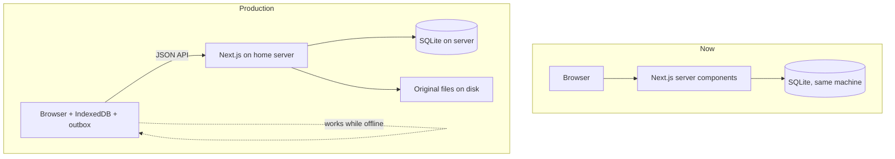
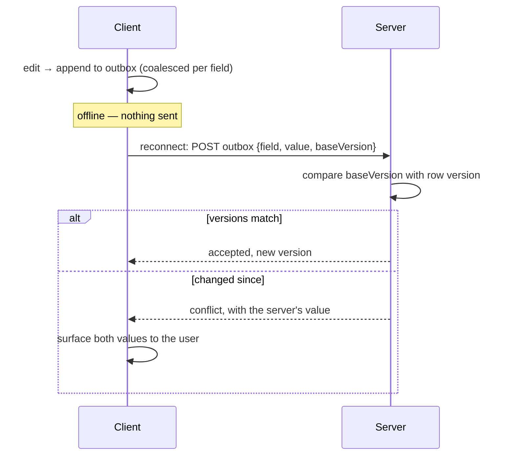

# PNHS Records — Production Design

**Audience:** a developer implementing the production round.
**Companion documents:** [technical-design.md](technical-design.md) describes the system as it
stands today; [changes.md](changes.md) is the prioritised backlog this design serves.

This document covers the four areas that need designing before code: multi-format import,
accounts and roles, offline editing with sync, and deployment.

> ### Status — corrected 12 August 2026
>
> Most of this document described work that has since been built, and in two places the build
> settled a question differently from the design. Those sections are corrected in place rather
> than left to mislead; each correction says what changed and why.
>
> | Area | State |
> |---|---|
> | §2 Multi-format import — SHS, JHS, Form 137 | **Built** |
> | §3 Migrations | **Built**, with a different mechanism — see the correction in §3 |
> | §4 Accounts and roles | **Built.** Soft delete deliberately **not** built — see §4 |
> | §5 Offline editing and sync | **Read-only half built** (§5a). Sync still open, still gated on the question below |
> | §6 Deployment | **Built** |
> | §9 The frontend | **Built** — new section, added with the redesign |
>
> The open question in §5 is unanswered and still decides whether the rest of it is 4–6 weeks of
> work or none.

---

## 1. What changes, in one picture

Today the app is single-machine and local: pages read SQLite directly, one user, no accounts.

Production changes three things at once, and they interact:



The consequential shift is the second one: **an offline client cannot read the server's SQLite
directly**, so an API layer becomes necessary for anything that must work offline. That single
requirement is what makes item #8 large.

Read-only pages that need no offline support can keep reading SQLite in server components. Do
not convert the whole app.

---

## 2. Multi-format import

### Dispatcher

Three parsers behind one entry point, all producing the existing `Sf10Record`
([lib/sf10/types.ts](../lib/sf10/types.ts)):

```
file → sniff → ┬ SF10-SHS   .xlsx, sheets FRONT / BACK      (built)
               ├ SF10-JHS   .xlsx, sheets Front / Back      (built)
               └ Form 137   .docx, two internal variants     (built)
                                    ↓
                              Sf10Record → database
```

**Sniffing rules.** `.docx` → Form 137. `.xlsx` → read sheet names: `FRONT`/`BACK` is SHS,
`Front`/`Back` is JHS. The casing difference is reliable across every real file inspected.
Anything unrecognised must **fail loudly** — a silently mis-parsed permanent record is worse
than a rejected file.

`importBytes()` in [lib/import/import-sf10.ts](../lib/import/import-sf10.ts) becomes the
dispatcher. Its existing hash dedup, upsert and issue recording are format-independent and
stay as they are.

### Form 137: two variants, one normaliser

The 20 sample files split by how grades are stored:

| Variant | Count | Extraction |
|---|---|---|
| **Word tables** | 17 | Parse `<w:tbl>` directly. Rows and cells map cleanly to subject rows. |
| **Embedded worksheets** | 3 | Each `word/embeddings/Microsoft_Excel_Worksheet*.xlsx` is a complete workbook — open with the existing `Workbook.fromBuffer()` and read cells with `getCell()`. |

Both yield 8 units per file: **4 years × (grades, monthly attendance)**. Extraction differs;
everything after it is shared.

Learner identity comes from the Word body text in both variants. Word splits runs mid-word for
formatting reasons, so the parser must **join all runs within a paragraph before matching**,
then match labels tolerantly — real files contain `FEM ALE`, `Year: 19 82`, `F ISHERMAN` and
`Gen. Av e: 80`.

**Rule to encode explicitly: never recompute a Form 137 final rating.** Quarters
`75, 80, 85, 87` carry a final of `83.20`, not their mean of `81.75` — the old curriculum used
a different computation that is not documented anywhere available. Store what the document
says. This is the same principle as the SF10 rule about not writing formula cells, for the
same reason: the source document is the authority.

`PALIZA` has 16 tables rather than 8. **Settled by the build: it is one learner's form
duplicated inside a single file, not two learners and not a transferee.** The first copy is
imported and the rest flagged. `npm run test:f137` parses all 20 sample files, including this
one and both storage variants.

Two other things the build settled that this design could not:

- **No LRN exists on these forms.** A generated `F137-…` key derived from name and birthdate
  keeps identity stable across re-imports, and `lrn_placeholder` makes the UI show *No LRN ·
  pre-2011 record* so an invented value is never presented as a real one.
- **A year with printed subject names but no marks is not an attended year.** One learner
  dropped out in January; importing the blank Third and Fourth Year would have asserted an
  enrolment that never happened.

### Storing originals

Every imported file is kept on disk, keyed by its existing SHA-256, with a `source_files` row
pointing at it. Two reasons: a Form 137 cannot be reprinted onto a modern form, so the original
*is* the reissuable artefact; and for SF10 it makes any future re-parse possible without asking
the registrar for files again.

### `curriculum` and the print guard — do not skip this

Form 137 terms are stored with a `curriculum = 'old'` marker on `enrollment_terms`. That column
is not cosmetic; **one existing function will misbehave without a guard against it.**

`availableForms()` in [../lib/db/queries.ts](../lib/db/queries.ts) decides which print buttons
appear purely from grade level:

```ts
if (terms.some((t) => t.level <= 10)) forms.push("jhs");
```

Store a Form 137 learner's First–Fourth Year as levels 7–10 — which is the natural mapping —
and the record page will offer **"Print SF10 JHS"** for a 1995 record. That is exactly the
outcome the archive-only decision exists to prevent, arrived at by accident.

**`availableForms()` must exclude terms where `curriculum = 'old'`.** A learner with only
Form 137 terms gets no print buttons at all; the original `.docx` is offered for download
instead.

---

## 3. Migrations — build this first · **BUILT, with one correction**

Everything else in this document adds columns to tables that **already hold real learner
data**. There is currently no mechanism that can do that.

`db/schema.sql` is eight `CREATE TABLE IF NOT EXISTS` statements, re-executed on every boot by
`getDb()`. That is idempotent and self-repairing for *new* tables, and it has served well. But:

> **`CREATE TABLE IF NOT EXISTS` cannot alter an existing table.** Adding a column to one of
> those statements is a silent no-op on any database where the table already exists.

The production round introduces roughly a dozen new columns — `deleted_at`, `deleted_by`,
`version`, `curriculum`, `units_earned`, guardian fields, place of birth. On the live database
every one of them would simply fail to appear, and nothing would say so. The failure surfaces
later, as a query reading a column that does not exist.

### The mechanism

> #### ⚠ Correction — the version does **not** live in `PRAGMA user_version`
>
> This section originally specified `PRAGMA user_version` as the schema version. That is the
> conventional answer for SQLite and it does not work here.
>
> **A hosted libSQL database refuses to execute `PRAGMA user_version = n` at all** — it answers
> *"SQL not allowed statement"*. Reading the pragma works; writing it does not. So the read
> would have succeeded, every migration would have applied, the write recording that fact would
> have failed, and the next boot would have applied all of them again — against real learner
> data, with `ALTER TABLE` statements that are not idempotent.
>
> The version lives in a **`schema_version` table** instead, written inside the same transaction
> as the migration it records. See `lib/db/migrations.ts` and commit `f4a988f`.
>
> An existing local database whose version was already recorded in the pragma is adopted on
> first run, so nothing re-applies.

Ordered steps applied on boot **after** the existing create pass:

```
1. read schema_version           → current   (adopting PRAGMA user_version if no row yet)
2. for each migration numbered > current, in order:
       run it inside a transaction
       write its number to schema_version, in that same transaction
3. new columns therefore arrive exactly once, on whichever database is running
```

Rules that matter:

- Migrations are **append-only and never edited** once run anywhere. Fix a bad migration with a
  new one.
- Each runs in its own transaction, so a failure leaves the version unchanged and the database
  consistent.
- `CREATE TABLE IF NOT EXISTS` in `schema.sql` stays as it is for brand-new databases; the
  migration list handles existing ones. A fresh database runs the creates, then the migrations
  find nothing to do.
- **Back up before running migrations against real data.** See §6.

This is roughly 30 lines of code and it is not optional once real records exist.

`npm run test:migrations` runs the steps against a copy of a pre-migration database and asserts
both that the new columns arrive and that the existing rows survive.

---

## 4. Accounts and roles · **BUILT**

Two roles, as specified:

| | Admin | Adviser |
|---|---|---|
| Search, view, print | ✓ | ✓ |
| Import, add, edit | ✓ | ✓ |
| Delete | ✓ | ✓ |
| Restore a deleted record | ✓ | — |
| Manage adviser accounts | ✓ | — |

### Implementation

- `users` — id, username, `password_hash`, `role`, `active`, timestamps.
- `sessions` — token, user, expiry. Signed, HTTP-only, `SameSite=Lax` cookie.
- Hashing with **`scrypt` from `node:crypto`**. No new dependency; consistent with the rest of
  the project's dependency discipline.
- Route protection applied to pages *and* API endpoints. Endpoints must be checked
  independently — an offline client calls them directly.

> #### ⚠ Correction — middleware cannot be the guard
>
> This originally said "route protection in middleware". Middleware runs on the Edge runtime,
> where `node:crypto` does not exist, so it **cannot verify a session cookie** — only notice
> that one is present. Importing the cookie name from the auth module dragged the database layer
> into the Edge bundle and failed the build outright, which is the boundary announcing itself.
>
> Every page, action and route handler calls `requireUser()` for itself. `middleware.ts` still
> exists, but only to spare a signed-out visitor a redirect chain; treating it as the security
> boundary is how Next.js applications get walked past their own authentication.
>
> Two more the build settled: **API routes answer 401, never a redirect** (a caller following a
> redirect gets HTTP 200 and an HTML form where it asked for a workbook, which reads as
> success), and **rate limiting had to move into the database**, because a module-level counter
> is per-instance memory and on a host running more than one instance it counts a fraction of
> the attempts.

The unglamorous parts, which are the ones that get skipped:

- **Rate limiting and lockout on login.** Without it, a LAN-local brute force against
  `pantao123` succeeds in minutes.
- **A minimum password policy**, because advisers will otherwise choose the school name.
- **Invalidate existing sessions on password change or account deactivation.** A deactivated
  adviser with a live cookie is still an adviser until it expires.
- Session cookies: `HttpOnly`, `Secure`, `SameSite=Lax`, with a real expiry.

### Delete becomes soft delete — **NOT BUILT. Deliberately.**

> Everything in this section describes a design that was **not implemented**. `students` has no
> `deleted_at` and no `deleted_by`, delete is permanent, and there is no restore. The "Restore a
> deleted record" row in the roles table above therefore describes nothing that exists.
>
> It was dropped so the importer's dedup query could stay as it is — see the trap below, which
> is the reason. If soft delete is ever added, this section and that trap are the design to
> follow, and the query change is not optional.

The design, if it is picked up:

`students` gains `deleted_at` and `deleted_by`. Deleting sets them; every query filters them
out. The adviser experience is unchanged — the record disappears from search, and the
typed-LRN confirmation still applies — but an admin can restore it, and the action is
attributable.

It also keeps a learner's id stable across a delete-and-reimport, where today they would come
back with a new id.

> ### ⚠ Soft delete breaks the importer unless you change this query too
>
> The dedup rule in [../lib/import/import-sf10.ts](../lib/import/import-sf10.ts) treats a file
> as already-imported only if it produced a learner **who still exists**:
>
> ```sql
> FROM import_files f
> JOIN students s ON s.id = f.student_id
> WHERE f.sha256 = ? AND f.status IN ('imported','updated')
> ```
>
> Soft delete leaves the student row in place. The join therefore still matches, the file is
> still reported "already imported", and **a soft-deleted record cannot be restored by
> re-importing its file.**
>
> That is the exact bug that was reported and fixed earlier in this project — hard delete left
> the `import_files` row behind and branded the file permanently imported. Soft delete
> reintroduces it by a different route.
>
> **The query must become:**
>
> ```sql
> JOIN students s ON s.id = f.student_id AND s.deleted_at IS NULL
> ```
>
> This is called out here, next to the soft-delete decision, because whoever implements soft
> delete will be editing `queries.ts` and has no reason to go looking inside the importer.

### Audit

`record_history` is append-only: student, table, field, old value, new value, user, timestamp.
It serves autosave recovery (#4) and account attribution (#6) with one mechanism. Write to it
inside the same transaction as the change itself, or the two can disagree.

**Growth needs a decision, not silence.** Autosave-as-you-type means a row per field change per
learner, forever. At 5,000 learners with ~40 subjects and four quarters each, ordinary encoding
generates hundreds of thousands of rows a year, and re-encoding a corrected grade adds more.

That is not a performance problem — SQLite will not notice — but it is unbounded growth in a
table nobody prunes. Either set a retention window (full detail for the current school year,
then keep only the last value per field) or state explicitly that unbounded growth is accepted
because the rows are small. Decide it now, while the table is empty.

---

## 5. Offline editing and sync

The largest item. Design it deliberately, because a records system that silently loses or
mis-merges a grade is worse than one that refuses to work offline.

### What this costs, and why

**Estimated 4–6 weeks.** Everything else in the backlog totals around 13 days. This one item is
therefore roughly three-quarters of the production round, and the estimate covers an API layer,
IndexedDB, an outbox, per-row versioning, conflict UI, a service worker, PWA install, offline
record creation and LAN HTTPS — each with its own failure modes.

> **Open question that should be settled before any of it is built.**
>
> The server sits on the school LAN. Everyone in the building reaches it whether or not the
> internet is up, so "no internet" is not by itself a reason for any of this work.
>
> The two scenarios that *would* justify it are very different in cost:
>
> | Scenario | What it actually needs | Cost |
> |---|---|---|
> | Advisers encode grades on a laptop away from school, then sync | Everything in this section | 4–6 weeks |
> | Insurance against the server or network being down | A UPS, plus a read-only cached copy so records stay *viewable* | ~2–3 days |
>
> If the real need is the second, most of this section should be deleted rather than built.
> Confirm which before starting.

### 5a. What is built: the read-only half

The cheap column of that table now exists, and it cost about what the table said it would. It is
worth having whichever way the question is answered, and nothing in it is wasted if the
expensive column is built later.

- A **service worker** (`public/sw.js`), network-first for pages, cache-first for the shell and
  the self-hosted fonts. Records opened while connected stay readable when the server does not
  answer.
- **Connection state is permanent chrome in the masthead** — `Live` or `Cached`, never a toast.
  A toast tells you once, while you are looking elsewhere, and then deletes the evidence.
- A **freshness line** on a cached page: *Saved copy · as of 10:42, 12 Aug*. A real timestamp,
  because "offline" on its own does not tell a registrar whether the grade they encoded an hour
  ago is in front of them.
- **Editing is disabled offline, visibly.** There is no outbox behind those cells yet, so a
  grade typed while disconnected would be written nowhere and reported as saved. A dead field
  costs an adviser a minute; a silently discarded quarter costs a learner their record.
- Installable as a PWA (`app/manifest.ts`), which is what makes `display: standalone` and the
  offline shell useful together.

Three things the build settled that the design did not anticipate:

- **`navigator.onLine` is not the signal.** It reports whether a network interface exists, which
  on a school LAN is true whether or not anything is listening — exactly the outage this half is
  meant to cover. The service worker announces when it has had to answer from cache, which is
  the signal that actually means "you are looking at a copy".
- **The offline state must be able to release itself.** The first version could only return on
  an `online` event, so one failed request left every grade cell disabled with no event coming,
  because the browser had never thought it was offline. A 204 probe (`/api/health`) now runs
  *only* while offline and proves the way back. This is covered by `npm run test:browser`.
- **Cached pages expire after twelve hours.** Sign-out purges them, but a browser closed without
  signing out would otherwise leave every record the last person opened readable on a shared
  office machine indefinitely. Twelve hours covers an outage lasting most of a working day and
  does not survive the machine being left overnight.

### Scope boundary

Not everything needs to work offline. The useful minimum:

| Works offline | Requires the server |
|---|---|
| Search the learner index | Importing files |
| View any record opened before going offline | Printing an SF10 |
| Edit grades and learner details | Managing accounts |
| Create a new record | Restoring a deleted record |

Printing needs the template and the fill engine, both server-side. Import needs files that live
on the server. Neither is worth replicating client-side.

### Client storage

**IndexedDB**, holding:

1. The learner index — already shipped whole to the browser for search, so this is a natural
   fit. At 5,000 learners the payload is roughly 400 KB; slim the fields and cache it rather
   than re-sending it each load.
2. Full records for anything opened, so they remain viewable and editable offline.
3. The **outbox**: queued changes not yet accepted by the server.

### Sync protocol



- **Version at the unit of edit, not the parent row.** `term_subjects` is already one row per
  subject, so that row carries the version. This is the detail that decides whether the feature
  is usable — see below.
- Changes are **coalesced per field** — autosave-as-you-type would otherwise generate an
  operation per keystroke. One pending change per field is enough.
- **Conflicts are shown, never merged silently.** If two people edited the same grade, a person
  decides. Last-writer-wins is acceptable for a section name; it is not acceptable for a mark
  on a permanent record.
- `record_history` records both sides of a conflict, so nothing is lost even if the wrong
  choice is made.

> ### ⚠ Versioning granularity decides whether conflicts are real
>
> Versioning the *term* while sending changes *per field* manufactures conflicts that never
> happened. Two advisers editing different subjects in the same Grade 9 term both bump the same
> term version, so the second one is told their edit conflicts — when nothing overlapped.
>
> On a grid where someone encodes forty subjects in a sitting, that fires constantly. Users
> learn within a day to dismiss the conflict prompt without reading it, and the one safety
> mechanism protecting grade data becomes noise.
>
> Version `term_subjects` rows individually. A genuine conflict — two people editing the same
> subject's Q2 — is then rare and worth a person's attention, which is the entire point.

### Practical requirements

- **HTTPS is mandatory** — service workers do not run over plain HTTP except on `localhost`.
  This is needed for the LAN deployment regardless; see §6. Note that a self-signed certificate
  must be installed in the **trust store of every client device**, or registration fails and
  offline silently does not work.
- New records created offline need client-generated ids that cannot collide. Use a UUID as a
  client key, mapped to the server's integer id on first sync.
- **Two people creating the same learner offline will violate `UNIQUE(lrn)` on sync.** This is
  the most likely offline conflict in practice — two advisers both encoding a new transferee.
  A blind insert fails and the second adviser's work appears lost. On sync, match an incoming
  new record against existing learners **by LRN first**, and merge into that learner rather
  than inserting.
- The outbox must survive a browser restart, and the user must be able to see that changes are
  pending. Silent queues erode trust the first time something appears lost.

---

## 6. Deployment

> **This section was rewritten after the deployment target changed.** It originally specified a
> mini-PC on the school LAN. The system now runs on Vercel with a hosted database and object
> storage. The hardware advice is gone; the obligations that came with holding this data are not,
> and several of them got *harder*, not easier.

### What runs where

| | |
|---|---|
| Application | Vercel, region `sin1` (Singapore) — nearest to Albay |
| Database | Turso (libSQL), same region |
| Original files | Cloudflare R2, private bucket |
| Templates | Read from the deployment bundle, unchanged |

Region matters more than it looks. Every page is a handful of queries, and the default `iad1`
puts each one on a Pacific round trip. `preferredRegion` is pinned on the route handlers.

### Capacity

72 real files average **180 KB** — measured and reliable.

| Resource | At 5,000 learners | Against the free allowance |
|---|---|---|
| Original files | ~900 MB | R2 gives 10 GB. Comfortable. |
| Database | 40–80 MB | Turso gives several GB. Not close. |
| Bandwidth | Small — records are text | R2 charges no egress at all |

The database figure is a conservative ceiling rather than a measurement: 44% of the current
database is fixed per-table overhead, so extrapolating from a small sample overstates it. It errs
high, which is safe.

**The one that would have bitten:** Vercel Blob includes roughly 1 GB on the free plan, and
5,000 learners is ~900 MB. That ceiling would have been reached during the first full intake,
which is why originals went to R2 instead.

### Operational requirements

The LAN version of this list was about disks and power. The hosted version is about credentials
and copies.

1. **Backups are no longer free, and nobody will notice until they are needed.** The registrar
   used to be able to back up by copying one file. That ability is gone. `npm run backup` writes
   the hosted database to a local SQLite file — schedule it, and:
   - **A copy must leave the building.** An encrypted external drive the registrar takes home is
     enough at this scale. A backup living only in the same cloud account as the database is not
     a backup against the failure most likely to occur — the account.
   - **An untested backup is a hypothesis.** Restore one and open a learner record:
     `$env:PNHS_DB_PATH = 'backups/pnhs-....db'; npm run dev`. Do it on a schedule.
   - Take one **before running migrations** against real data.
2. **The R2 bucket must stay private.** Files are served through `/api/students/[id]/original`,
   which checks the session. A public bucket URL is a shareable link to a child's record and
   would undo the accounts work entirely.
3. **Credentials are now the perimeter.** Four secrets — the Turso token and three R2 values —
   are all that stand between the internet and every record. They belong in Vercel's environment
   settings and in `.env.local`, never in git (`.gitignore` covers `.env.*`). Rotate them if a
   laptop holding them is lost.
4. **Vercel Hobby is non-commercial-use only.** This is a commissioned system for an institution.
   The technical fit is fine; the terms are not, and an account suspension takes the school's
   records offline. Moving to Pro also raises function duration from 60 s to 300 s.
5. **Two admin accounts.** Only an admin can issue accounts or reset a password. A single admin
   who is away is a system nobody can administer. The Accounts page warns while there is one.

### Personal data

Unchanged in substance, and more pressing now: this holds the personal data of **thousands of
children** — names, birthdates, sex, and from Form 137 their parents' names, occupations and home
addresses — on a public URL rather than a machine in a locked office.

- **The Philippines' Data Privacy Act (RA 10173) applies to schools.** Someone should be named as
  accountable for this data. Flagging it is not the same as having addressed it.
- **Encryption at rest** is now the provider's, not the school's. That is a floor and not a
  solution: it does nothing against a leaked credential, which is the realistic failure here.
- **Encrypt the off-site backup.** It is the copy most likely to be lost.
- **Retention.** Permanent records are permanent by design; `record_history`, sessions and import
  logs are not, and should not accumulate indefinitely.
- **Access is a privacy control.** An adviser can read every learner in the school. That was
  decided deliberately — no adviser-to-section mapping exists — but it is a policy question the
  school should be asked, not one this system should answer silently.

### Scale check at 5,000 learners

- ~200,000 `term_subjects` rows. The existing indexes on `student_id` and `term_id` are enough.
- The learner index shipped to the browser for search is ~400 KB at that size. Fine.
- **Bulk import is the one thing that needed a different shape**, and has one:
  `npm run push:archive` runs the same importer directly against the hosted database from a
  machine that already has the files. A thousand files through the browser is two hundred
  round trips; this is one process with progress and a resume-by-rerun property.

---

## 7. Build order — as executed

The order below was followed and everything except the last line is done.

| | | |
|---|---|---|
| 0 | Migrations (§3) — before anything that adds a column | ✅ |
| 1 | Items #1–#3 from [changes.md](changes.md) — small, independent | ✅ |
| 2 | #4 autosave with `record_history` | ✅ |
| 3 | #5 JHS importer | ✅ |
| 4 | #6 accounts — before offline, which needs identity to attribute changes | ✅ |
| 5 | #7 Form 137 | ✅ |
| 6 | #9 deploy | ✅ |
| 7 | The frontend redesign and the read-only offline half (§5a, §9) | ✅ |
| 8 | **#8 offline sync** — the remaining item | ⬜ **Settle the open question in §5 first** |

Do not start #8 before reading §5. Sync without identity cannot attribute or resolve a conflict —
identity now exists, so that objection is discharged; the open question about whether the feature
is needed at all is not.

---

## 8. Testing

`npm run roundtrip` and `npm run verify` prove the SF10 fill path end to end, and the rest of
this list has been filled in as the work landed. **The "no committed browser tests at all" this
section used to open with is no longer true** — `npm run test:browser` exists.

| Area | Test | State |
|---|---|---|
| JHS importer | `npm run roundtrip` covers JHS files — same guarantee already proven for SHS | ✅ |
| Form 137 | `npm run test:f137` parses all 20 sample files; both variants, plus `PALIZA` | ✅ |
| Migrations | `npm run test:migrations` runs against a copy of a **pre-migration** database and asserts the columns exist and the data survives | ✅ |
| Accounts | `npm run test:auth` — an adviser cannot reach admin routes; a deactivated account cannot act; a forged cookie is refused | ✅ |
| Deployment | `npm run smoke -- <url>` — the 401s, the 409 archive-only guard, and a file through ticket → object storage → import → byte-identical download | ✅ |
| Browser flows | `npm run test:browser` — see below | ✅ |
| Sync | Two clients editing the same subject conflict; two clients editing different subjects **do not** | ⬜ with #8 |

The sync row is still the one that would catch the versioning-granularity bug described in §5,
and it is still unwritten because the feature is unbuilt.

### `npm run test:browser`

Thirty-six checks covering what no amount of `fetch` can see. It runs Chrome through Playwright
via `channel: "chrome"` — the browser already on the machine, because Playwright's own Chromium
download is a few hundred megabytes and is what failed when this was first attempted. It builds
its own scratch database and starts its own dev server against it, rather than accepting a URL
the way `smoke.ts` does: these checks type into grade cells, and a server someone else started
is a server pointing at who-knows-what.

Most of these exist because something shipped broken and was caught by eye rather than by a test:

- **Arrow keys must not change a grade.** On `<input type="number">` the up and down arrows
  increment the value. The encoding grid binds them to movement, so a stray keypress over a mark
  moves the cursor instead of silently rewriting the mark and autosaving it. A safety property,
  not an ergonomic one.
- **The offline lock must release itself** without a reload. See §5a.
- **Vertical movement must stop at the term boundary** — holding ↓ past the last subject of
  Grade 7 must not land in Grade 8.
- **The typefaces must actually load.** They did not, for months, and a screenshot pass did *not*
  catch it. `@font-face` requests and `<link rel="preload" crossorigin>` are anonymous — no
  cookie — so `middleware.ts` saw no session and redirected all six woff2 files to `/login`, for
  signed-in users too. The browser received an HTML page where it expected a font and fell back
  to Segoe UI and Constantia, which look close enough to pass a glance. The matcher now excludes
  `fonts/`, `manifest.webmanifest` and `sw.js`; the check asserts `document.fonts.check()`, which
  reports a face as usable rather than merely mentioned. The same redirect was silently costing
  the PWA its manifest.
- **Light must be the default even on a dark machine**, the switch must persist across a reload,
  and `data-theme` must be on `<html>` at `commit` — the last one is what proves the inline
  script beats the first paint, so a dark-mode user never gets a white flash. See §9.

`npm test` stays as it was: unit checks only, no server, fast. `test:browser` is separate for the
same reason `smoke` is — it needs something running.

---

## 9. The frontend

Redesigned twice. August 2026 replaced a warm manila "filing room" aesthetic with **"Engraved
Registry"** — sharp corners, engraved double rules, intaglio grain, Fraunces at display sizes —
on the premise that the app should look like the security document it produces. That premise was
right about the document and wrong about the room. The registrar is in front of this for whole
afternoons; a security engraving is a tiring thing to sit inside.

The current interface is **"Soft Office"**. Same information, same density where density matters,
but the furniture recedes: white plates on warm paper, generous corners, soft light instead of
rules. The record is still a security document — the guilloche and the seal survive — it just
stops announcing it on every plate.

Recorded here because the next person to touch it will otherwise re-litigate five decisions.

### The system

`app/globals.css` is the whole design system — plain CSS, custom properties, `data-*` variants.
No Tailwind, no CSS modules, no component library. About seventy class names are the contract
between it and the markup, and `scripts/test-browser.ts` asserts on a dozen of them, so a
restyle is a token-and-property job rather than a re-markup.

- **Palette.** Warm paper ground (`--ground`) under white plates (`--plate`). One `--accent`
  carries navigation and affirmation, `--advisory` covers pending and imported states, and
  `--alert` appears *only* for destruction and failing marks — that scarcity is the entire
  reason it reads as a warning. `--accent` and `--accent-solid` are separate values in light
  mode because the shade that clears 4.5:1 as 13px type is darker than the one that looks right
  as a block of button. Full dark palette, defined rather than filtered.
- **Geometry.** Four radii (`--radius` 10px plates, `--radius-sm` 6px controls, `--radius-xs`
  4px cells, `--radius-pill` for every chip). Plates are lit, not outlined: a hairline plus two
  soft shadow layers. Focus is a 3px halo (`--ring`) rather than a hard offset outline.
- **Type.** Atkinson Hyperlegible sets all UI text *and all headings* — drawn for low-vision
  legibility, which is not a niche concern in an office reading names and six-digit numbers all
  day, and its round open letterforms are the single biggest reason this reads as soft. Fraunces
  survives in exactly two places, the masthead wordmark and the learner's name on the rail: the
  institution and the person. IBM Plex Mono, tabular, for grades and LRNs. All three OFL and
  **self-hosted**; see `public/fonts/README.txt`.
- **Composition.** The record page is a sticky identity rail beside a scrolling column of term
  plates, so the learner's name and seal stay on screen while six years of terms move past.

### Five decisions worth not re-opening

The first three survive the restyle untouched — they were never about how it looked.

1. **Fonts are self-hosted, not linked.** The app has to render with no network — that was true
   when it ran on the registrar's PC and it is true again now that offline is a feature. A font
   CDN would defeat the service worker's precache and would also put a third party on the
   request path of a page showing a child's personal data.
   *The trap:* self-hosting puts the typefaces behind `middleware.ts`, and font requests carry no
   cookie, so for months the middleware redirected all six to `/login` and every screen silently
   rendered in Segoe UI. The matcher now excludes `fonts/`; §8 has the full account and the
   regression check. Anything else added under `public/` that the browser fetches anonymously
   needs the same exclusion.
2. **Grade-cell save state lives in the cell**, as an underline that fills, not in a floating
   indicator. This is the hook #8 attaches to: §5 requires versioning per `term_subjects` row,
   so one subject can be in conflict while thirty-nine are fine, and a single global indicator
   cannot express that. The conflict state is already styled.
3. **The seal and the term stamp are one function.** `promotionMark()` in
   `app/students/[id]/page.tsx` produces both. They were two expressions for a day and drifted
   immediately — the plate said "Incomplete" where the seal said "Not stated" about the same
   term. A permanent record that describes itself two ways on one screen is one nobody should
   trust.
4. **Light is the default and the OS preference is not consulted.** There is no
   `prefers-color-scheme` block in `globals.css`; dark is reached only through the masthead
   toggle, which writes `data-theme` onto `<html>`. Following the OS instead would mean a laptop
   that dims itself in the evening hands its user a different-looking app than the machine
   beside it — on shared office PCs the surprise costs more than the convenience. The toggle
   sits *outside* the signed-in block in `app/layout.tsx`, so it is reachable on the sign-in
   page too; someone who works in the dark should not have to log in first to turn the lights
   down.
5. **The theme lives in `localStorage`, not a cookie.** It is a display preference, it never
   needs to reach the server, and keeping it out of the cookie jar means signing out — which
   purges the service worker's page cache, see §5a — does not also reset how the app looks for
   the next person to sit down. A blocking inline script (`THEME_SCRIPT` in
   `app/_components/theme-toggle.tsx`) applies it in `<head>` before first paint; an effect
   cannot, because the root layout is a server component and dark users would see a white flash
   on every navigation. `next.config.mjs` sets no `script-src`, so it needs no nonce — if a CSP
   is ever tightened, that script is the thing that breaks.

### Not built

The sync surfaces designed in §5 — outbox drawer, conflict plate, provisional records, the LRN
merge screen. They are designed and they are not implemented, pending the open question.
