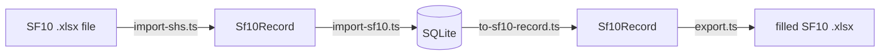
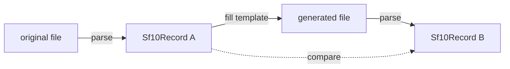

# PNHS Records — Technical Design

**Audience:** a developer taking this over.
**Status:** in use with real learner data.
**Last verified:** all claims in this document were re-run against the code on writing.

---

## 1. What this is

A local web app that holds SF10 permanent academic records for **Pantao National High
School** (School ID 301860, 3rd Dist.–Libon West, Albay, Region V) and reprints them by
filling the school's own Excel templates. It replaces a folder of loose `.xlsx` files with one
searchable database, and it runs offline on a single machine in the registrar's office.

The system is small — 6,486 lines across 37 files, four runtime dependencies (`next`, `react`,
`react-dom`, `fflate`). That is deliberate. Most of the difficulty here is not in the code
volume but in a handful of non-obvious constraints imposed by the DepEd form itself. **Those
constraints are what this document exists to record.** A printed permanent record that is
subtly wrong looks completely fine, so the failure mode of this system is silent.

> One such bug already shipped and was caught only by a round-trip test: the exporter left the
> blank template's pre-printed subject names in unused rows, so a learner who took 8 subjects
> would print an SF10 listing subjects they never sat. See §4.5.

---

## 2. Architecture

Dependencies run strictly one way. Nothing in `lib/` imports from `app/`.

```
app/            pages, server actions, two route handlers
  │
  ├── lib/db/       queries, DB → Sf10Record bridge
  ├── lib/import/   import orchestration (hashing, upsert, issue recording)
  │
  └── lib/sf10/     cell maps, parser, exporter, normalisation, grading
        │
        └── lib/xlsx/   zip container, cell-level read/write
```

### The central contract

`Sf10Record` in [`lib/sf10/types.ts`](../lib/sf10/types.ts) is the shape that joins the three
directions of data flow:



Because importer and exporter meet at the same type *and* share the same cell maps, a round
trip is testable end to end — that is what `npm run roundtrip` exploits, and it is the single
most valuable test in the repo.

### Stack decisions

| Choice | Why |
|---|---|
| **Next.js 15** (App Router) | Server components query the database directly; no API layer needed for pages. |
| **`@libsql/client`** | One driver, two URLs — a local `file:` database for development and every verification script, a hosted libSQL database in production. libSQL is a SQLite dialect, so `schema.sql`, `PRAGMA user_version` and every SQL string are the same in both. See §3. |
| **Plain SQL, no ORM** | Twelve tables. A `schema.sql` plus parameterised statements is fewer moving parts than an ORM with a codegen step. |
| **`scrypt` from `node:crypto`** | Password hashing with no new dependency. Sessions are random opaque tokens stored as a SHA-256, so there is no signing secret to leak and a database dump contains no usable sessions. |
| **`@aws-sdk/client-s3`** | Cloudflare R2 for the imported originals. The largest dependency here, taken deliberately: the alternative storage ceiling is reached during the first full intake. Confined to [`lib/blob/store.ts`](../lib/blob/store.ts), which also has a local-disk backing so nothing else needs a bucket. |
| **Hand-written CSS** | Fonts are Windows-native (Constantia / Corbel / Consolas) so the UI renders correctly with **no network**, which a local offline app requires. |
| **`fflate`** | The only third-party runtime dependency. Zip read/write for the .xlsx surgery in §4. |

### Pin worth knowing about

**`typescript@^6` is pinned deliberately.** TypeScript 7 ships as `latest` and dropped the
JavaScript compiler API that Next.js 15 requires; installing it fails the build with
*"TypeScript 7 native compiler does not provide the JavaScript compiler API"*. An unguarded
`npm update` will break this.

---

## 3. Data model

Twelve tables in [`db/schema.sql`](../db/schema.sql), applied by `npm run db:migrate` (all
statements are `IF NOT EXISTS` / `INSERT OR IGNORE`, so this is idempotent and self-repairing).
Development applies them automatically on first use; production does not — see below.

```
students          identity. lrn UNIQUE — the only reliable key.
jhs_eligibility   1:1 with students. Elementary-completer details.
shs_eligibility   1:1 with students. JHS-completer details, admission/graduation dates.
enrollment_terms  one row per grade level (JHS) or per semester (SHS).
                  UNIQUE (student_id, level, semester)   -- semester NULL for JHS
term_subjects     one row per subject per term.
term_attendance   Form 137 only. One row per month per term; SF10 records no attendance.
school_settings   the school's own identity, self-seeded.
import_files      one row per file taken in, keyed by SHA-256.
import_issues     anything a human should check. Never blocks an import.
record_history    append-only. Every field change: what moved, from what, to what, when,
                  and by whom.
users             who may sign in. role is 'admin' or 'adviser'.
sessions          live sign-ins. Stores SHA-256 of the cookie value, never the value.
login_attempts    failed sign-ins, for lockout. Pruned on success and by age.
```

### Gotcha: the auth guard is not middleware

`requireUser()` in [`lib/auth/current-user.ts`](../lib/auth/current-user.ts) is called at the top
of **every** page, server action and route handler. [`middleware.ts`](../middleware.ts) only
redirects a cookie-less visitor to the sign-in page.

That split is forced, not stylistic. Middleware compiles for the Edge runtime, where
`node:crypto` does not exist — it cannot verify a session even in principle. Importing the
cookie *name* from `current-user.ts` was enough to fail the build with *"Reading from node:url is
not handled"*, which is why [`lib/auth/cookie.ts`](../lib/auth/cookie.ts) exists and holds
nothing but a string. Keep that file dependency-free.

A guard in front of a route can also be routed around; one inside it cannot. Next.js has shipped
more than one middleware auth-bypass advisory.

**If you add anything that reads or writes learner data, it starts with `requireUser()`.** There
is no ambient protection to inherit.

### Gotcha: a key is not a path

`import_files.stored_path` holds an object **key** (`originals/<sha256>.<ext>`), not a filesystem
path. [`lib/blob/store.ts`](../lib/blob/store.ts) still accepts the old `data/originals/...` form
so rows written before object storage keep working.

Two things that guard it, both of which replaced a filesystem check and are easy to drop by
accident:

- `isBlobKey()` refuses anything not matching the key pattern. A value read back out of the
  database must not be able to address storage we did not write — the same concern as the old
  path-traversal check, a different mechanism.
- `blobKey()` **rebuilds** the extension from the trailing alphanumeric run rather than filtering
  characters out. Filtering looked equivalent and was not: `"../../evil"` filtered down to
  `"....evil"`, which the guard then refused, so the file would have been stored under a key
  nothing could ever read back. Losing the archive copy silently is worse than refusing the
  import.

### Gotcha: the browser does not choose where its bytes land

There are two key namespaces, and the distinction is a security boundary rather than filing:

    originals/<sha256>.<ext>    the archive. Written server-side, from bytes we have read.
    uploads/<32 hex>.<ext>      one inbound file. Random, and deleted once imported.

The upload key used to be the content hash the browser claimed. R2 overwrites on PUT, so a
signed-in caller could state the hash of an existing archived original and replace it — and a
Form 137 has no second source to restore from. The importer recomputing the hash protected the
database row, not the object; the overwrite had already happened by then.

`uploadKey()` is generated in [`lib/blob/store.ts`](../lib/blob/store.ts) and the ticket route
never reads a key from the request. **Nothing a client sends may decide where a write goes.**
`/api/import/upload` deletes the `uploads/` copy once `importBytes()` has written the archive
one, so the namespace does not accumulate.

### One driver, two URLs

[`lib/db/client.ts`](../lib/db/client.ts) points `@libsql/client` at a local file unless
`TURSO_DATABASE_URL` is set. That single decision is what keeps the verification scripts
meaningful: `npm run roundtrip` and `npm run check:ga` are the proof that a printed SF10 matches
the source form, and they run offline against a local file **through the driver production
uses**. A separate local driver would make them prove something about code that never ships.

The cost is that every data-access function is `async`. That is not cosmetic — a query that was
microseconds in-process is a network hop in production, so anything reading per-term in a loop
must be batched. `getSubjectsForStudent()` and `getAttendanceForStudent()` exist for exactly
that reason; prefer them over calling `getSubjects()` once per term.

### Writes take a transaction object, not a connection

`db.exec("BEGIN")` no longer works: a hosted connection is pooled, so the next statement may go
to a different one. Multi-statement writes use `db.transaction("write")` and pass the
transaction down — which is why `recordChange()` takes its runner as an argument. Writing
history through the shared client while a transaction is open would land it *outside* that
transaction, leaving a log entry for a change that got rolled back.

### Two decisions that carry weight

**Subjects are rows, not columns.** JHS has a fixed 13–14 learning areas, but SHS subject
lists vary by track and strand — the real files range from **5 to 10 subjects per semester**.
Modelling subjects as rows lets one schema serve both forms. Do not be tempted to flatten
this.

**LRN is the identity key, not the name.** Filipino name matching is defeated by suffixes,
inconsistent middle names and spacing. The real files also contain `Ň` (N with caron) where
`Ñ` was intended — see `BIBLAŇAS`, `CAŇETA`, `PEŇAFLOR`.

### Gotcha: null-prototype rows

libSQL returns rows that are array-like as well as keyed by column name. React refuses to
serialise those across the server/client boundary and fails with *"Only plain objects can be
passed to Client Components"*. Every row therefore leaves
[`lib/db/queries.ts`](../lib/db/queries.ts) through `plain()` / `plainAll()`, which spread it
into a real object.

**If you add a query that feeds a client component, you must do the same.**

### Gotcha: schema changes need `npm run db:migrate`

Schema setup is memoised per process and skipped entirely in production, so **adding a table to
`schema.sql` does not take effect until you run `npm run db:migrate`** (or restart the dev
server) — you get `no such table` until you do.

Adding a *column* needs a migration regardless: `CREATE TABLE IF NOT EXISTS` cannot alter a
table that already exists, and it fails silently. See [`lib/db/migrations.ts`](../lib/db/migrations.ts).

---

## 4. Filling and reading the SF10 — read this before touching `lib/sf10` or `lib/xlsx`

This is where silent corruption lives.

### 4.1 Zip surgery, not an Excel library

[`lib/xlsx/workbook.ts`](../lib/xlsx/workbook.ts) treats the `.xlsx` as what it is — a zip of
XML parts — and rewrites **only** the worksheet parts it touches. Every other entry passes
through byte-for-byte.

This is not premature cleverness. The SF10 templates contain embedded logos, printer settings,
workbook protection, VML drawings and form-control checkboxes. General-purpose Excel libraries
drop several of these on write, which would corrupt an official DepEd form.

Evidence, from `npm run verify`:

| File | Entries | Byte-identical | Rewritten |
|---|---|---|---|
| JHS | 26 | **23** | `workbook.xml`, `sheet1.xml`, `sheet3.xml` |
| SHS | 25 | **22** | `workbook.xml`, `sheet2.xml`, `sheet1.xml` |

Logos, `printerSettings.bin`, `vmlDrawing1.vml` and the four `ctrlProps` all survive intact.

### 4.2 Write inputs only — the governing rule

Final ratings, general averages and PASSED/FAILED are **shared formulas** (`<f t="shared">`)
owned by the template. Rewriting a shared-formula host cell breaks its siblings in confusing
ways.

So [`lib/xlsx/cells.ts`](../lib/xlsx/cells.ts) **refuses** to write into any cell containing a
formula — it throws `FormulaCellError`. We supply quarter ratings; `forceFullRecalcOnLoad()`
sets `fullCalcOnLoad="1"` so Excel recomputes everything when the file opens.

This has a valuable side effect: **the printed form re-derives every number independently of
[`lib/grading.ts`](../lib/grading.ts)**. Every print is a free cross-check. If the screen and
the paper ever disagree, `lib/grading.ts` is wrong.

`setCell` also preserves the `s=` style attribute, which is what keeps borders, fonts and
alignment. Text is written as `t="inlineStr"` so `sharedStrings.xml` never needs touching.

> **Forensic note.** Our writer emits inline strings; Excel-authored files use shared strings
> and contain **zero** `inlineStr` cells. Counting them is a reliable way to tell whether a
> file came from this app or from the school. This is how we established that an early
> "sample JHS file" was actually our own demo output.

### 4.3 The two JHS exceptions

JHS **Homeroom Guidance** and **CAT** have no `AVERAGE` formula on the form, so their final
rating is ours to write. `jhsFinalRatingIsComputed(index)` in
[`lib/sf10/jhs-map.ts`](../lib/sf10/jhs-map.ts) encodes this, and both the exporter and the
edit UI consult it. Everywhere else the template owns the final rating.

### 4.4 SHS blocks are irregular — do not "simplify" them

JHS blocks are perfectly regular: one offset table applies to all four grade levels.

SHS blocks are **not**. In [`lib/sf10/shs-map.ts`](../lib/sf10/shs-map.ts) each of the four
semester blocks carries its own explicit row numbers, because:

- the track/strand row is `headerRow + 2` on three blocks but `+1` on one;
- the remarks value sits in **column E** on the first block and **column F** on the other three.

Collapsing this into a computed offset will put values in the wrong cells, and the result will
still open cleanly in Excel.

### 4.5 Unused subject rows must be cleared

**The bug that shipped.** The blank SHS template pre-prints the standard Core subject names
down the first ten rows of each block. The exporter filled rows `0..N-1` and left the rest
alone — so a learner with 8 subjects printed a form listing 2 subjects they never took, with
blank grades.

`fillShs` now blanks every unused row's category, name, Q1 and Q2. Two things make this safe,
both verified against the template XML:

1. Those rows' final-grade and action-taken formulas already evaluate to an **empty string**
   (`t="str"` with an empty cached value) when their quarters are blank, so clearing cannot
   leave `#DIV/0!` on the printed page.
2. It is exactly how the school's own filled files look.

**JHS is deliberately not treated this way.** There the learning-area names are fixed parts of
the form rather than per-learner data, and the exporter always writes the full list.

Note that clearing needs its own code path: `setCells` *skips* empty values by design, so that
a half-filled record cannot wipe existing data. `SheetWriter.clear()` exists for this.

### 4.6 The round trip



Both ends use the **same parser**, so representation differences (Excel date serials vs. the
text dates we write) normalise away and only genuine data loss surfaces. If a cell-map address
were wrong, the value would land somewhere the reader does not look and the comparison would
fail.

`npm run roundtrip` — **13 of 13 records survive with no data loss.**

---

## 5. Import pipeline and data quality

### 5.1 The parser reuses the exporter's map

[`lib/sf10/import-shs.ts`](../lib/sf10/import-shs.ts) walks the same `SHS_BLOCKS`,
`SHS_LEARNER` and `SHS_SUBJECT_COL` definitions the exporter writes through. They cannot drift
apart.

Formula cells (final grade, action taken) are **read** here even though they are never
written — in the school's real files most were pasted in as literal values rather than left as
formulas, so `getCell` takes whatever the cell holds.

### 5.2 Flag, never drop

A record with a suspect LRN or an unreadable date **still imports in full**; the problem is
recorded in `import_issues` with the exact source cell. Every function in
[`lib/sf10/normalise.ts`](../lib/sf10/normalise.ts) is total — none throw, none discard a value
they cannot understand.

The rationale is domain, not engineering: *a learner with a mistyped LRN is still that
learner's permanent record.* Refusing the import would leave them with no record at all.

### 5.3 What the school's real files actually contain

This list is the evidence behind every branch in `normalise.ts`. Do not "clean up" these code
paths without a real file to test against.

| Found in the real files | Handling |
|---|---|
| Birthdates as **Excel serials** (`37896`) | Converted. Epoch is **1899-12-30** — the two-day offset is what cancels Excel's fake 1900 leap year. |
| A birthdate as the text **`06/09/200`** | A year short. Kept verbatim and flagged. Silently "correcting" it to 2000 or 2001 would be inventing a fact about a person. |
| Sex as **`MALE` / `FEMALE`** | Normalised to `M` / `F` (also accepts `LALAKI` / `BABAE`). |
| LRNs of **11, 12 and 14 digits** | Kept and flagged. Length is not enforced — see §5.2. |
| **Byte-identical duplicate files** | Collapsed by SHA-256. |
| Genuine typos (`Fundammentals of Accountancy…`) | Stored **verbatim**. Never re-word a permanent record. |

### 5.4 The dedup rule — state it precisely

> **A file counts as already-imported only if it produced a learner who still exists.**

```sql
FROM import_files f
JOIN students s ON s.id = f.student_id     -- no live learner, no duplicate
WHERE f.sha256 = ? AND f.status IN ('imported','updated')
```

The obvious implementation — match on hash alone — was a **data-loss bug**. Deleting a learner
left the `import_files` row behind, so their file was branded "already imported" permanently
and the record could never be restored by re-importing.

The join is also what lets a file that *failed to parse* be retried once the reason it failed
is fixed.

Two consequences to preserve if you touch this:

- `recordFile()` must **upsert** (`ON CONFLICT(sha256) DO UPDATE`), because the row now
  outlives the learner. `last_insert_rowid()` is meaningless after a DO UPDATE — re-select by
  hash.
- `saveIssues()` clears the previous issues for a file before inserting, or a re-import stacks
  a second copy onto the review list.

Correspondingly, `deleteStudent()` marks the history row `status='deleted'` and nulls its
`student_id` rather than deleting it — the import history is worth keeping, and one predicate
resolves the tension between the table's dedup role and its audit role.

### 5.5 Uploads are a route handler, not a server action

[`app/api/import/upload/route.ts`](../app/api/import/upload/route.ts) exists because **server
actions cap request bodies at 1 MB by default** and one SF10 is roughly 220 KB. Selecting a
handful of files through a server action fails with a confusing body-size error. Route handlers
have no such cap.

---

## 6. Verification

| Command | What it proves |
|---|---|
| `npm run roundtrip` | File → DB → printed form loses nothing. **The most important test.** |
| `npm run verify` | The template survives filling byte-for-byte. **Equally load-bearing.** |
| `npm run spike` | All **786** mapped cells (449 JHS + 337 SHS) exist and are safe to write. |
| `npm test` | Grade arithmetic matches the template's own formulas, including Excel's half-away-from-zero rounding. |
| `npm run import:dry` | Parses a folder and reports what *would* import. Writes nothing. |
| `npm run check` | Generates SF10 files straight from stored records. |

`roundtrip` and `verify` are the two that must never be allowed to fail. Everything else is
convenience.

**Known gap:** the Playwright browser flows used during development were never committed —
they live outside the repo. Search, edit, delete, import and the print route currently have no
checked-in end-to-end coverage. Worth closing.

**Also outstanding:** no one has yet formally compared a generated form against a printed
original in Excel's print preview. The mechanical evidence is strong (§4.1, §4.6) but that
sign-off has never happened.

---

## 7. Risks and limits

Stated plainly.

### Urgent

**`data/pnhs.db` sits inside a OneDrive-synced folder and now holds real learner data.**
SQLite and file-sync tools corrupt each other — the sync client can copy a database mid-write.
This should move somewhere unsynced before the school relies on it, with backups handled
deliberately instead.

### Structural

- **No authentication.** Anyone who can open the browser can read, edit or delete any record.
- **No backups.** Deleting a learner is guarded by a typed-LRN confirmation, but there is no
  undo and no snapshot.
- **No audit trail for edits.** `import_files` records how a record arrived; nothing records
  who later changed a grade.
- **Single-user, single-machine.** `getDb()` caches one connection on `globalThis`; nothing
  handles concurrent writers.

### Not built yet

- **JHS import.** The parser is SHS-only. See §8 — this is now unblocked.
- The `ANNEX` sheet (list of subjects taken), remedial-class records, and the certification
  section are read by nothing and written by nothing.

### Papercut

`npm run roundtrip`, `npm run import:dry` and the `/import` page all default to a folder named
`sf10-copy`, which has since moved to `sf10-files/sf10-copy`. The defaults are stale.

---

## 8. Next: the JHS importer

**This is now unblocked, and more cheaply than expected.** `sf10-files/SF10-jhs/` contains
**30 genuine school-authored JHS files** (verified: zero `inlineStr` cells, so not our own
output), and the existing JHS cell map already reads them correctly — last name, first name,
LRN and the Grade 7 subject rows all resolve on the files spot-checked.

The work is therefore to write `parseJhsWorkbook` against
[`lib/sf10/jhs-map.ts`](../lib/sf10/jhs-map.ts) mirroring `import-shs.ts`, and to generalise
`importBytes` to dispatch on form type by sheet names (`Front`/`Back` for JHS,
`FRONT`/`BACK` for SHS — note the casing differs, which is a usable discriminator).

Two things already anticipate this:

- `import_files.form` already stores which form a file was.
- `writeRecord()` already scopes its term replacement by grade level (`level >= 11` for SHS),
  so importing a learner's JHS form will not disturb their SHS terms, and vice versa.

The remaining SHS files in `sf10-files/sf10-shs/` (9 files) already parse cleanly with zero
issues.
