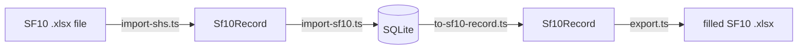
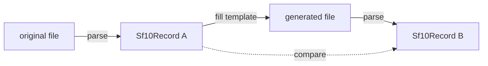

# PNHS Records — Technical Design

**Audience:** a developer taking this over.
**Status:** a local Windows application, in use with real learner data.
**Last verified:** 18 August 2026 — every claim below re-run against the code, not against the
other documents.

> ### The system stopped being a web app on 18 August 2026
>
> It ran hosted — Vercel, a Turso database, originals in a Cloudflare R2 bucket, accounts in two
> roles — and it is now an **Electron application installed on the registrar's PC**, opened with
> one password. Three whole layers went with the hosting: the accounts system, the offline
> service worker, and object storage.
>
> That inverted most of the previous round's architecture, and favourably. The obstacle to
> offline work was that *an offline client cannot read the server's SQLite directly, so an API
> layer becomes necessary*. When the server is the local machine, the obstacle is not solved so
> much as dissolved.
>
> If you are holding a copy of this document older than that date, discard it: it describes
> credentials, regions and roles that no longer exist. Companion documents:
> [production-design.md](production-design.md) for the architecture and the decisions,
> [changes.md](changes.md) for the backlog and what each item settled.

---

## 1. What this is

A **Windows desktop application** that holds SF10 permanent academic records for **Pantao
National High School** (School ID 301860, 3rd Dist.–Libon West, Albay, Region V) and reprints
them by filling the school's own Excel templates. It replaces a folder of loose `.xlsx` files
with one searchable database.

It is a Next.js application inside an Electron shell. The shell starts the Next server on
`127.0.0.1` and opens a window pointed at it; the application itself is unchanged by the move,
which is the reason for doing it that way — the exporter, the three importers and the whole of
`lib/` are Node code that has to keep running as Node code. See
[production-design.md](production-design.md) §6.

The system is small for what it does, and got smaller: five runtime packages, down from seven.

| | |
|---|---|
| `next`, `react`, `react-dom` | the framework |
| `@libsql/client` | the database driver — see §3 |
| `fflate` | zip read/write for the `.xlsx` surgery in §4 |

`electron` and `electron-builder` are development dependencies: the shell is not something the
application imports, it is what starts it.

That restraint is deliberate. Most of the difficulty here is not in the code volume but in a
handful of non-obvious constraints imposed by the DepEd form itself. **Those constraints are what
this document exists to record.** A printed permanent record that is subtly wrong looks completely
fine, so the failure mode of this system is silent.

> One such bug already shipped and was caught only by a round-trip test: the exporter left the
> blank template's pre-printed subject names in unused rows, so a learner who took 8 subjects
> would print an SF10 listing subjects they never sat. See §4.5.

---

## 2. Architecture

Dependencies run strictly one way. Nothing in `lib/` imports from `app/`.

```
app/            pages, server actions, two route handlers
  │
  ├── lib/db/       queries, DB → Sf10Record bridge
  ├── lib/import/   import orchestration (hashing, upsert, issue recording)
  │
  └── lib/sf10/     cell maps, parser, exporter, normalisation, grading
        │
        └── lib/xlsx/   zip container, cell-level read/write
```

### The central contract

`Sf10Record` in [`lib/sf10/types.ts`](../lib/sf10/types.ts) is the shape that joins the three
directions of data flow:



Because importer and exporter meet at the same type *and* share the same cell maps, a round
trip is testable end to end — that is what `npm run roundtrip` exploits, and it is the single
most valuable test in the repo.

### Stack decisions

| Choice | Why |
|---|---|
| **Next.js 15** (App Router) | Server components query the database directly; no API layer needed for pages. That was an obstacle while offline sync was on the table and is exactly right for a local app. |
| **Electron, `output: "standalone"`** | The shell spawns `.next/standalone/server.js` as a child of Electron's own binary with `ELECTRON_RUN_AS_NODE`, which saves bundling a second Node runtime. It binds **`127.0.0.1`** — see §3. |
| **`@libsql/client`** | One driver, one `file:` database. The hosted URL is gone; the driver stayed because `npm run roundtrip` only proves a printed SF10 matches its source form while it exercises the driver that ships. |
| **Plain SQL, no ORM** | Eleven tables. A `schema.sql` plus parameterised statements is fewer moving parts than an ORM with a codegen step. |
| **`scrypt` from `node:crypto`** | Hashing for the one password that opens the app. No new dependency, and being slow on purpose is the whole point of a password store. |
| **Hand-written CSS** | `app/globals.css` is the entire design system — no Tailwind, no component library. About seventy class names are its contract with the markup, and `scripts/test-browser.ts` asserts on a dozen of them. See [production-design.md](production-design.md) §9. |
| **Self-hosted typefaces** | Fraunces, Atkinson Hyperlegible and IBM Plex Mono, all OFL, served from `public/fonts`. **Nothing is fetched at runtime**, which is now a hard requirement rather than a preference: the app has no network at all. |
| **`fflate`** | Zip read/write for the .xlsx surgery in §4. |

### Pin worth knowing about

**`typescript@^6` is pinned deliberately.** TypeScript 7 ships as `latest` and dropped the
JavaScript compiler API that Next.js 15 requires; installing it fails the build with
*"TypeScript 7 native compiler does not provide the JavaScript compiler API"*. An unguarded
`npm update` will break this.

---

## 3. Data model

Eleven tables in [`db/schema.sql`](../db/schema.sql), all `IF NOT EXISTS` / `INSERT OR IGNORE`,
so applying them is idempotent and self-repairing. **The app applies them itself on first use,
in every environment**, which is a change — see the gotcha below.

```
schema_version    which migrations have run. One row. See the gotcha below.
students          identity. lrn UNIQUE — the only reliable key.
jhs_eligibility   1:1 with students. Elementary-completer details.
shs_eligibility   1:1 with students. JHS-completer details, admission/graduation dates.
enrollment_terms  one row per grade level (JHS) or per semester (SHS).
                  UNIQUE (student_id, level, semester)   -- semester NULL for JHS
term_subjects     one row per subject per term.
term_attendance   Form 137 only. One row per month per term; SF10 records no attendance.
school_settings   the school's own identity, self-seeded.
import_files      one row per file taken in, keyed by SHA-256.
import_issues     anything a human should check. Never blocks an import.
record_history    append-only. Every field change: what moved, from what, to what, when.
                  `user_id` names a person on rows written while the app had accounts, and is
                  null on everything written since. See below.
```

**`users`, `sessions` and `login_attempts` are gone.** Migration 4 drops the last two, and
`schema.sql` no longer creates any of the three. It deliberately does *not* drop `users`:
nothing reads it, but `record_history.user_id` names real people on every row written during
the accounts round, and dropping the table would leave that history pointing at bare integers.
The column has no foreign key, so keeping it costs one dormant table on databases that already
had it, and buys the ability to still answer who changed a grade in August 2026.

### Gotcha: the schema is applied at runtime, and it has to be

`getDb()` used to skip schema setup entirely when `NODE_ENV === "production"`. That was right
for what it was written for: a serverless host has no long-lived process, so every cold start
would re-run fifteen `CREATE TABLE IF NOT EXISTS` statements and a migration check over the
network for nothing. Setup became an explicit `npm run db:migrate`, and production just
connected.

**The installed app runs as production and has no such step.** A first launch on a new machine
would have connected to an empty file, skipped the creates, and failed on the first query with
`no such table` — an app that cannot be opened, on the one machine that matters.

Setup now runs on first use in every environment, memoised on `globalThis` for the life of the
process: once per launch, microseconds, against a file that is already open.
`npm run db:migrate` still exists for the repository, where migrating without starting a server
is useful and where seeing what a migration did before trusting it with real records is more so.

### Gotcha: the pre-upgrade snapshot's destination is a parameter, not a lookup

`runMigrations(db, snapshotDir?)` copies the database aside before altering it — the project's
own *"back up before running migrations against real data"* rule, enforced instead of
remembered. A migration that fails was already safe; this is for one that succeeds and is
wrong.

Two things about its shape are deliberate and easy to undo by "simplifying":

**The destination is passed in.** `runMigrations` is handed a `Client`, which does not reveal
which file it is connected to. Tests migrate scratch databases in a temp folder and `openDb()`
opens whatever a script asks for, so resolving `dataDir()` inside the runner would file backups
of throwaway databases into the school's records folder. Only `getDb()` and `scripts/migrate.ts`
pass a directory, because only they know they are holding real data.

**`VACUUM INTO` lives in [`lib/db/snapshot.ts`](../lib/db/snapshot.ts), on its own.** The
obvious home is `lib/backup.ts`, next to the registrar's backup button — but that module
imports `getDb()` from `lib/db/index.ts`, which imports `migrations.ts`, so importing it from
`migrations.ts` closes a cycle. The module holds one statement and imports nothing but a type.
It is worth a file because the quote-escaping in it is the kind of detail that gets fixed in
one copy and not the other.

It fires only when the recorded version is **greater than zero** and there is pending work: a
fresh install reports version 0 with everything pending, and an empty file is not worth
copying. A failed snapshot **throws**, so nothing is migrated — which currently surfaces as
every page returning 500, an unhelpful face on a correct decision. Improving that surface is a
known follow-up.

### Gotcha: the schema version is a table, not `PRAGMA user_version`

The conventional answer for SQLite is `PRAGMA user_version`, and this project does not use it.

The reason was the hosted database: **Turso refuses to execute `PRAGMA user_version = n`** — it
answers *"SQL not allowed statement"*. Reading worked; writing did not. Taken at face value that
produces the worst available failure — the read succeeds, every migration applies, the write
recording that fact fails, and the next boot applies them all again against real learner data,
with `ALTER TABLE` statements that are not idempotent.

That database is gone, and the local file would accept the pragma quite happily. **The table
stays anyway.** Every database in service already records its version there; switching would
need its own migration to achieve nothing; and the table has one property the pragma lacks —
it is ordinary data, so it is covered by the surrounding transaction and by backups.

Migrations are append-only and never edited once run anywhere. Fix a bad one with a new one.

### Gotcha: the guard is inside every route, and there is nothing else

`requireUnlocked()` in [`lib/auth/guard.ts`](../lib/auth/guard.ts) is called at the top of
**every** page, server action and route handler. `middleware.ts` is deleted.

That discipline came from the hosted deployment, where middleware could not verify a session
even in principle — it compiles for the Edge runtime, which has no `node:crypto` — and where
Next has shipped more than one middleware auth-bypass advisory. A guard in front of a route can
be routed around; one inside it cannot.

Deleting the file also removed its worst trap, which is worth recording because the same shape
recurs. `@font-face` requests and `<link rel="preload" crossorigin>` carry **no cookie**, so a
matcher that did not exclude them sent all six woff2 files to the sign-in redirect. The browser
received an HTML page where it expected a font and fell back to Segoe UI — silently, for months,
for signed-in users too, because the fallback looks close enough that a screenshot pass does not
catch it. The PWA manifest was being lost the same way.

**If you add anything that reads or writes learner data, it starts with `requireUnlocked()`.**
There is now no ambient protection whatsoever to inherit.

It is tempting to think a local app does not need a guard. It does: this is an HTTP server on
loopback, and every process running as this user can send it a request.

### Gotcha: `ELECTRON_RUN_AS_NODE` makes the app vanish

The shell spawns the Next server as a child of **Electron's own binary**, with
`ELECTRON_RUN_AS_NODE=1` — that variable turns the executable into a plain Node runtime, which
is what saves bundling a second copy of Node and about 50 MB of installer.

The variable is inherited. If it is already set when the app itself launches — because the
terminal that started it has it set, or a parent process does — then **Electron never becomes an
application at all.** `require("electron")` returns a path string instead of the API, the first
line touching `app` throws *"Cannot read properties of undefined"*, and the process exits. It
has already detached from the console by then, so what a user sees is an icon that does nothing.

This is not hypothetical, twice over: it is what this app does to its own children, and it is
what happens under any tooling that itself runs inside Electron. It cost a confusing debugging
session — the packaged app exited instantly, created no data directory, and printed nothing.

`electron/main.cjs` checks for it on the first line and exits with an explanation instead of a
stack trace. Nothing more can be done: by the time the file runs, Electron has already decided
not to be an application.

### Gotcha: the server must bind 127.0.0.1

[`electron/main.cjs`](../electron/main.cjs) passes `HOSTNAME=127.0.0.1` to the standalone
server. **Next binds `0.0.0.0` without it.**

On the school LAN that would publish every learner's permanent record to anyone who found the
port, with a password screen as the only thing in the way, on a machine nobody is watching.
This is the one security property the desktop shape rests on, and it is a single environment
variable — which is exactly the kind of thing that gets dropped in a refactor.

**`npm run check:server` proves it**, and it is wired into `npm run build:desktop`. It starts
the built server and requires this machine's own LAN address to refuse the connection. Verified
to catch the bad case: with the variable removed, the server binds `0.0.0.0` and answers HTTP
200 for `/unlock` on the LAN IP.

### Gotcha: a key is not a path

`import_files.stored_path` holds an object **key** (`originals/<sha256>.<ext>`), not a filesystem
path. [`lib/blob/store.ts`](../lib/blob/store.ts) still accepts the old `data/originals/...` form
so rows written before object storage keep working.

Two things that guard it, both of which replaced a filesystem check and are easy to drop by
accident:

- `isBlobKey()` refuses anything not matching the key pattern. A value read back out of the
  database must not be able to address storage we did not write — the same concern as the old
  path-traversal check, a different mechanism.
- `blobKey()` **rebuilds** the extension from the trailing alphanumeric run rather than filtering
  characters out. Filtering looked equivalent and was not: `"../../evil"` filtered down to
  `"....evil"`, which the guard then refused, so the file would have been stored under a key
  nothing could ever read back. Losing the archive copy silently is worse than refusing the
  import.

### Gotcha: a subject's position is data, not presentation

`term_subjects.ordinal` decides three things at once, all through the array index:

- `fillJhs` writes subject *i* into template row `firstSubject + i` — the line of the printed
  permanent record it occupies.
- `jhsFinalRatingIsComputed(i)` — rows 13 and 14 have no AVERAGE formula in the template, so the
  app supplies their final rating and the first 12 belong to Excel.
- `JHS_GENERAL_AVERAGE_SUBJECT_ROWS = 8` — only the first eight count toward the general average,
  which decides promotion and honours.

So reordering is a change to the record. `swapSubjectOrder()` writes both moved rows to
`record_history` and clears any `general_average` imported from the form, for the same reason
editing a quarter does: the SF10's own general average is a live formula over the first eight
rows, so the printed workbook recomputes the moment the order changes. Leaving the imported
figure in place would have the app showing one number and the print showing another.

Two mechanical traps, both covered by [scripts/test-subject-order.ts](../scripts/test-subject-order.ts):
`deleteSubject` leaves gaps, so the neighbour is found by ordering rather than `ordinal ± 1`; and
`UNIQUE (term_id, ordinal)` is checked per statement, so a swap needs three UPDATEs with the first
row parked below the term's minimum.

### Gotcha: the upload flow was three hops and is now one

The browser used to ask for a presigned ticket, PUT the bytes straight into R2, then tell the
server which keys to import. That existed because a serverless function caps request bodies at
4.5 MB — about twenty SF10s — and the school's archive is over a thousand files.

The server is on this machine now and the file is already on its disk, so
`/api/import/ticket`, `presignUpload()` and the key-import branch of `/api/import/upload` are
all deleted. What is left is a multipart POST, still batched, still a route handler rather than
a server action because **server actions cap request bodies at 1 MB** and one SF10 exceeds it.

One rule from that design survives and should not be relaxed: **nothing a client sends decides
where a write goes.** The upload key used to be the content hash the browser claimed, and R2
overwrites on PUT — so a signed-in caller could name an existing archived original and replace
it, and a Form 137 has no second source to restore from. `uploadKey()` is still generated
server-side in [`lib/blob/store.ts`](../lib/blob/store.ts), and `isBlobKey()` still refuses any
stored value that is not a key we wrote.

### Gotcha: paths, and the day the build shipped the school's records

Three assumptions held in a repository and none of them hold in an installed app: that
`process.cwd()` is the project root, that `data/` sits beside the code, and that the folder the
app is in can be written to. [`lib/paths.ts`](../lib/paths.ts) is now the single answer to
"where is X" — `appDir()` for read-only resources shipped with the app, `dataDir()` for
everything written. Both fall back to today's layout when unset, so the repository is unchanged.

**Then the build shipped learner data, and produced no error.**

Next traces which files each route reads so it can copy them into `.next/standalone`, and it
does that by evaluating path expressions statically. `join(process.cwd(), "data")` is exactly
the shape it can evaluate: it resolved the folder, could not tell which file inside would be
opened, and copied **all of it** — the live database, four backups beside it, and twenty
archived Form 137 originals carrying children's names, their parents' occupations and their
home addresses. Straight into the bundle, from where the installer would have handed them to
whoever installed the app.

The tests passed. The installer worked. It was found by listing a directory.

Two things now stand in the way, and both are needed:

- `DATA_FOLDER` in `lib/paths.ts` is read from the environment, which the build cannot resolve,
  so it stops trying. `outputFileTracingExcludes` was tried first and had **no effect at all** —
  the traced entries are relative paths like `../../../data/x.db` and no pattern matched them.
- **`npm run check:bundle`** refuses to package a bundle containing anything that looks like a
  record: a `.db`, a `.docx`, an `.xlsx` outside `templates/`. It runs inside
  `npm run build:desktop`, between the build and electron-builder.

`.next/standalone` is otherwise the whole story: `templates/**` and `db/**` are named in
`outputFileTracingIncludes` because both are opened through a path built at runtime and the
tracer cannot see them either — the same mechanism, failing in the opposite direction.

### One driver, one file

[`lib/db/client.ts`](../lib/db/client.ts) points `@libsql/client` at a SQLite file. The hosted
branch is gone; the driver stayed, and that is what keeps the verification scripts meaningful:
`npm run roundtrip` and `npm run check:ga` are the proof that a printed SF10 matches the source
form, and they prove it **through the driver that ships**. Swapping in a second SQLite library
now would make them prove something about code the app does not run.

The cost is that every data-access function is `async`, which is no longer buying anything and
is not worth unwinding. Batching still matters for a different reason: `getSubjectsForStudent()`
and `getAttendanceForStudent()` exist so a record page is a handful of queries rather than one
per term, and a loop of awaited round trips is slow even in-process.

### Writes take a transaction object, not a connection

Multi-statement writes use `db.transaction("write")` and pass the transaction down — which is
why `recordChange()` takes its runner as an argument. Writing history through the shared client
while a transaction is open would land it *outside* that transaction, leaving a log entry for a
change that got rolled back.

This was forced by connection pooling against the hosted database, where `db.exec("BEGIN")`
could be followed by a statement on a different connection. It is kept because it is correct
anyway, and because unwinding it would mean touching every write path to gain nothing.

### Two decisions that carry weight

**Subjects are rows, not columns.** JHS has a fixed 13–14 learning areas, but SHS subject
lists vary by track and strand — the real files range from **5 to 10 subjects per semester**.
Modelling subjects as rows lets one schema serve both forms. Do not be tempted to flatten
this.

**LRN is the identity key, not the name.** Filipino name matching is defeated by suffixes,
inconsistent middle names and spacing. The real files also contain `Ň` (N with caron) where
`Ñ` was intended — see `BIBLAŇAS`, `CAŇETA`, `PEŇAFLOR`.

### Gotcha: null-prototype rows

libSQL returns rows that are array-like as well as keyed by column name. React refuses to
serialise those across the server/client boundary and fails with *"Only plain objects can be
passed to Client Components"*. Every row therefore leaves
[`lib/db/queries.ts`](../lib/db/queries.ts) through `plain()` / `plainAll()`, which spread it
into a real object.

**If you add a query that feeds a client component, you must do the same.**

### Gotcha: schema changes need a restart, and columns need a migration

Schema setup is memoised per process, so **adding a table to `schema.sql` does not take effect
until the process restarts** — you get `no such table` until it does.

Adding a *column* needs a migration regardless of any restart: `CREATE TABLE IF NOT EXISTS`
cannot alter a table that already exists, and it fails silently. See
[`lib/db/migrations.ts`](../lib/db/migrations.ts).

---

## 4. Filling and reading the SF10 — read this before touching `lib/sf10` or `lib/xlsx`

This is where silent corruption lives.

### 4.1 Zip surgery, not an Excel library

[`lib/xlsx/workbook.ts`](../lib/xlsx/workbook.ts) treats the `.xlsx` as what it is — a zip of
XML parts — and rewrites **only** the worksheet parts it touches. Every other entry passes
through byte-for-byte.

This is not premature cleverness. The SF10 templates contain embedded logos, printer settings,
workbook protection, VML drawings and form-control checkboxes. General-purpose Excel libraries
drop several of these on write, which would corrupt an official DepEd form.

Evidence, from `npm run verify`:

| File | Entries | Byte-identical | Rewritten |
|---|---|---|---|
| JHS | 26 | **23** | `workbook.xml`, `sheet1.xml`, `sheet3.xml` |
| SHS | 25 | **22** | `workbook.xml`, `sheet2.xml`, `sheet1.xml` |

Logos, `printerSettings.bin`, `vmlDrawing1.vml` and the four `ctrlProps` all survive intact.

### 4.2 Write inputs only — the governing rule

Final ratings, general averages and PASSED/FAILED are **shared formulas** (`<f t="shared">`)
owned by the template. Rewriting a shared-formula host cell breaks its siblings in confusing
ways.

So [`lib/xlsx/cells.ts`](../lib/xlsx/cells.ts) **refuses** to write into any cell containing a
formula — it throws `FormulaCellError`. We supply quarter ratings; `forceFullRecalcOnLoad()`
sets `fullCalcOnLoad="1"` so Excel recomputes everything when the file opens.

This has a valuable side effect: **the printed form re-derives every number independently of
[`lib/grading.ts`](../lib/grading.ts)**. Every print is a free cross-check. If the screen and
the paper ever disagree, `lib/grading.ts` is wrong.

`setCell` also preserves the `s=` style attribute, which is what keeps borders, fonts and
alignment. Text is written as `t="inlineStr"` so `sharedStrings.xml` never needs touching.

> **Forensic note.** Our writer emits inline strings; Excel-authored files use shared strings
> and contain **zero** `inlineStr` cells. Counting them is a reliable way to tell whether a
> file came from this app or from the school. This is how we established that an early
> "sample JHS file" was actually our own demo output.

### 4.3 The two JHS exceptions

JHS **Homeroom Guidance** and **CAT** have no `AVERAGE` formula on the form, so their final
rating is ours to write. `jhsFinalRatingIsComputed(index)` in
[`lib/sf10/jhs-map.ts`](../lib/sf10/jhs-map.ts) encodes this, and both the exporter and the
edit UI consult it. Everywhere else the template owns the final rating.

### 4.4 SHS blocks are irregular — do not "simplify" them

JHS blocks are perfectly regular: one offset table applies to all four grade levels.

SHS blocks are **not**. In [`lib/sf10/shs-map.ts`](../lib/sf10/shs-map.ts) each of the four
semester blocks carries its own explicit row numbers, because:

- the track/strand row is `headerRow + 2` on three blocks but `+1` on one;
- the remarks value sits in **column E** on the first block and **column F** on the other three.

Collapsing this into a computed offset will put values in the wrong cells, and the result will
still open cleanly in Excel.

### 4.5 Unused subject rows must be cleared

**The bug that shipped.** The blank SHS template pre-prints the standard Core subject names
down the first ten rows of each block. The exporter filled rows `0..N-1` and left the rest
alone — so a learner with 8 subjects printed a form listing 2 subjects they never took, with
blank grades.

`fillShs` now blanks every unused row's category, name, Q1 and Q2. Two things make this safe,
both verified against the template XML:

1. Those rows' final-grade and action-taken formulas already evaluate to an **empty string**
   (`t="str"` with an empty cached value) when their quarters are blank, so clearing cannot
   leave `#DIV/0!` on the printed page.
2. It is exactly how the school's own filled files look.

**JHS is deliberately not treated this way.** There the learning-area names are fixed parts of
the form rather than per-learner data, and the exporter always writes the full list.

Note that clearing needs its own code path: `setCells` *skips* empty values by design, so that
a half-filled record cannot wipe existing data. `SheetWriter.clear()` exists for this.

### 4.6 The round trip



Both ends use the **same parser**, so representation differences (Excel date serials vs. the
text dates we write) normalise away and only genuine data loss surfaces. If a cell-map address
were wrong, the value would land somewhere the reader does not look and the comparison would
fail.

`npm run roundtrip` — **52 of 52 records survive with no data loss.**

---

## 5. Import pipeline and data quality

### 5.1 The parser reuses the exporter's map

[`lib/sf10/import-shs.ts`](../lib/sf10/import-shs.ts) walks the same `SHS_BLOCKS`,
`SHS_LEARNER` and `SHS_SUBJECT_COL` definitions the exporter writes through. They cannot drift
apart.

Formula cells (final grade, action taken) are **read** here even though they are never
written — in the school's real files most were pasted in as literal values rather than left as
formulas, so `getCell` takes whatever the cell holds.

### 5.2 Flag, never drop

A record with a suspect LRN or an unreadable date **still imports in full**; the problem is
recorded in `import_issues` with the exact source cell. Every function in
[`lib/sf10/normalise.ts`](../lib/sf10/normalise.ts) is total — none throw, none discard a value
they cannot understand.

The rationale is domain, not engineering: *a learner with a mistyped LRN is still that
learner's permanent record.* Refusing the import would leave them with no record at all.

### 5.3 What the school's real files actually contain

This list is the evidence behind every branch in `normalise.ts`. Do not "clean up" these code
paths without a real file to test against.

| Found in the real files | Handling |
|---|---|
| Birthdates as **Excel serials** (`37896`) | Converted. Epoch is **1899-12-30** — the two-day offset is what cancels Excel's fake 1900 leap year. |
| A birthdate as the text **`06/09/200`** | A year short. Kept verbatim and flagged. Silently "correcting" it to 2000 or 2001 would be inventing a fact about a person. |
| Sex as **`MALE` / `FEMALE`** | Normalised to `M` / `F` (also accepts `LALAKI` / `BABAE`). |
| LRNs of **11, 12 and 14 digits** | Kept and flagged. Length is not enforced — see §5.2. |
| **Byte-identical duplicate files** | Collapsed by SHA-256. |
| Genuine typos (`Fundammentals of Accountancy…`) | Stored **verbatim**. Never re-word a permanent record. |

### 5.4 The dedup rule — state it precisely

> **A file counts as already-imported only if it produced a learner who still exists.**

```sql
FROM import_files f
JOIN students s ON s.id = f.student_id     -- no live learner, no duplicate
WHERE f.sha256 = ? AND f.status IN ('imported','updated')
```

The obvious implementation — match on hash alone — was a **data-loss bug**. Deleting a learner
left the `import_files` row behind, so their file was branded "already imported" permanently
and the record could never be restored by re-importing.

The join is also what lets a file that *failed to parse* be retried once the reason it failed
is fixed.

Two consequences to preserve if you touch this:

- `recordFile()` must **upsert** (`ON CONFLICT(sha256) DO UPDATE`), because the row now
  outlives the learner. `last_insert_rowid()` is meaningless after a DO UPDATE — re-select by
  hash.
- `saveIssues()` clears the previous issues for a file before inserting, or a re-import stacks
  a second copy onto the review list.

Correspondingly, `deleteStudent()` marks the history row `status='deleted'` and nulls its
`student_id` rather than deleting it — the import history is worth keeping, and one predicate
resolves the tension between the table's dedup role and its audit role.

### 5.5 Uploads are a route handler, not a server action

[`app/api/import/upload/route.ts`](../app/api/import/upload/route.ts) exists because **server
actions cap request bodies at 1 MB by default** and one SF10 is roughly 220 KB. Selecting a
handful of files through a server action fails with a confusing body-size error. Route handlers
have no such cap, and on this machine there is no other cap either — the 4.5 MB serverless
body limit that shaped the old three-hop upload is gone with the serverless host. See §3.

---

## 6. Verification

**The two that must never be allowed to fail:**

| Command | What it proves |
|---|---|
| `npm run roundtrip` | File → DB → printed form loses nothing. **52 of 52 records survive.** The most important test in the repo. |
| `npm run verify` | The template survives filling byte-for-byte — 23 of 26 internal entries untouched (JHS), 22 of 25 (SHS). |

**Unit checks — `npm test`, no server, fast.** Eight suites:

| Suite | What it proves |
|---|---|
| `test-grading` | Grade arithmetic matches the template's own formulas, including Excel's half-away-from-zero rounding |
| `test-migrations` | Migrations run against a copy of a **pre-migration** database; new columns arrive, existing rows survive. Also the pre-upgrade snapshot: it is written, it **opens**, it is skipped for a fresh database, and a migration **does not run** when it fails |
| `test-f137` | All 20 Form 137 sample files parse — both storage variants, plus `PALIZA` |
| `test-unlock` | The password gate: first-run detection, the policy, lockout, idle expiry, a token that was never issued |
| `test-blob` | Storage keys, the traversal guards in §3, and a round trip |
| `test-backup` | A backup **opens**, and the learner is in it. Originals come with it. A same-disk destination is refused |
| `test-subject-order` | The two mechanical traps in reordering — gap-tolerant neighbours, and the three-UPDATE swap |
| `test-periods` | Three- and four-period terms, and that a filled workbook still writes out |

**Needs something running:**

| Command | What it proves |
|---|---|
| `npm run test:browser` | Real Chrome. See below. |

`npm run smoke` is deleted. It checked a deployed instance — the 401s, the archive-only guard,
and a file through ticket → object storage → import → byte-identical download — and every one
of those things is now either local or gone.

**Guarding the build:** `npm run check:bundle` refuses to package a bundle containing anything
that looks like a learner record. It is not a test of behaviour; it is the thing standing
between a path-resolution mistake and an installer full of children's data. See §3.

**Tools rather than tests:** `npm run spike` (all **786** mapped cells — 449 JHS + 337 SHS —
exist and are safe to write), `npm run import:dry` (parse a folder, report what *would* import,
write nothing), `npm run check` and `check:ga` (generate forms and general averages straight
from stored records), `npm run backup` (copy the database and originals elsewhere — see §7).

### `npm run test:browser`

Covers what no amount of `fetch` can see. It runs Chrome through Playwright via
`channel: "chrome"` — the browser already on the machine, because Playwright's own Chromium
download is a few hundred megabytes. It builds its own scratch database and starts its own dev
server against it rather than accepting a URL: these checks type into grade cells, and a server
someone else started points at who-knows-what.

Most of them exist because something shipped broken and was caught by eye rather than by a test —
**arrow keys must not silently rewrite a grade**, vertical movement must stop at the term
boundary, the typefaces must actually load, and light must be the default even on a dark
machine. It also asserts that a locked app redirects to `/unlock` and that a wrong password is
refused. [production-design.md](production-design.md) §8 has the full account of each.

The offline checks are deleted with the service worker they tested.

**Two things a person still has to do**, and neither is automatable from here:

- Nobody has formally compared a generated form against a printed original in Excel's print
  preview. The mechanical evidence is strong (§4.1, §4.6); the sign-off has never happened.
- Nobody has installed the packaged `.exe` on a machine that has never run this app and walked
  the first-run path. The pieces are each verified; the whole has not been. See the checklist in
  [production-design.md](production-design.md) §6.

---

## 7. Risks and limits

Stated plainly.

> **This section has been rewritten twice by deployment changes.** It once listed no
> authentication, no backups, no audit trail and single-user as structural risks; the production
> round built all four. It then listed leaked credentials and a public bucket; the move to a
> local application removed the credentials and the bucket. Both sets are deleted rather than
> annotated. What follows is what is true of an application installed on one PC.

### Operational

- **The machine is the single point of failure.** One disk holds the only copy of thousands of
  children's permanent records, with no provider replication behind it. This is the cost of
  leaving the cloud, and the backup discipline below is not good practice — it is the whole
  mitigation.
- **A backup nobody has restored is a hypothesis.** Backing up is a file copy again, which is
  what the registrar understood before any of this. `npm run backup` and the Settings button use
  `VACUUM INTO` rather than copying the file, because copying a live SQLite database catches it
  mid-write. **One copy must leave the building, encrypted.**
- **The password gates the app, not the file.** Anyone who can read `pnhs.db` off the disk has
  every record, whatever the unlock screen asks for. Disk encryption on the machine is the
  proportionate answer and it is a school action, not a code change.
- **Nobody can reset the password.** There is no administrator to ask. A forgotten password
  means restoring from a backup, which is another reason the backup has to be real.
- **`data/` in the repository sits inside a OneDrive-synced folder**, and SQLite and file-sync
  tools corrupt each other — the sync client copies a database mid-write. The installed app is
  pointed at `%LOCALAPPDATA%` and is safe; a developer working in this checkout is not.

### Structural

- **Nothing distinguishes one operator from another.** `record_history` still records what
  changed, from what, to what and when — which is what makes autosave-with-no-undo recoverable —
  but new rows carry no user. On a shared office PC there is nobody to name. This was the
  accepted price of removing accounts; rows written during the accounts round keep their ids.
- **Delete is permanent.** Soft delete was designed and deliberately not built, so there is no
  undo and no restore — only the typed-LRN confirmation and the backup. The reasoning, and the
  importer query that must change if it is ever added, are in
  [production-design.md](production-design.md) §4.
- **`record_history` grows without bound.** Autosave writes a row per field change, forever.
  Not a performance problem — SQLite will not notice — but nothing prunes it, and the retention
  policy is still undecided.
- **Accountability under RA 10173 is unnamed.** This holds the personal data of thousands of
  children, including parents' names, occupations and home addresses from Form 137. Someone
  should be named as accountable for it. Flagging that is not the same as having addressed it.

### Not built

- The `ANNEX` sheet (list of subjects taken), remedial-class records, and the certification
  section are read by nothing and written by nothing.
- The **report card** (SF9 / Form 138) asked for in `docs/patch-1.md`. A separate form with its
  own template, cell map, parser and print path. It cannot be specified without the school's
  blank form and a few filled examples.

### Papercut

`npm run import:dry` still defaults to a folder named `sf10-copy`, which has since moved to
`sf10-files/sf10-copy`.

---

## 8. What is not built, and where its design lives

This section used to plan the JHS importer. **That is built** — `npm run roundtrip` covers JHS
files and `import_files.form` records which form each file was.

It then pointed at offline sync as the one outstanding item. **That item no longer exists.** It
was gated on a question — whether advisers genuinely encode grades away from school, or whether
the worry was only downtime — and the move to a local application answered it a third way: there
is no server to be away from and no network to lose. The outbox, per-row versioning, conflict
resolution, offline record creation and the LAN HTTPS problem are all dissolved rather than
deferred. The service worker that served the read-only half is deleted.

What is left:

| Item | Where |
|---|---|
| **Report card (SF9 / Form 138)** — import and print | `docs/patch-1.md`. Needs the school's blank form first |
| Soft delete and restore | [production-design.md](production-design.md) §4, including the importer query it breaks |
| Everything else, with what each built item settled | [changes.md](changes.md) |

`docs/patch-1.md` also asks for two roles, Admin and Adviser, with advisers able only to import.
That predates the single-password design and is superseded by it: one password cannot express
two permission sets. Reinstating roles means reinstating accounts.
